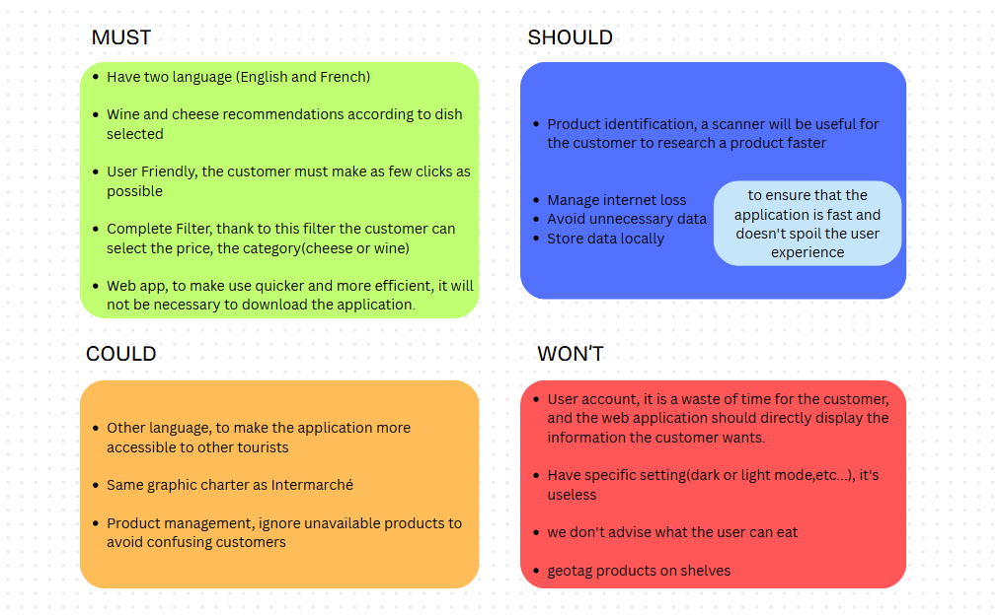

# Project Charter

**Project Name:** Bubble Intermarché  
**Team:** Team 3  
**Document Edited by:** Léna 
**Last Time Modified:** 04/30/2025

## Project definition
This project aims to create a web application that recommends which wine or cheese to pair with a dish.

The client is the retail chain "Intermarché", more specifically the Intermarché of Saint-Rémy-de-Provence. Our contact points are Célia, The supermarket's quality assurance, and Chrys, an apprentice.

## Scope

This project should be done using the no-code platform Bubble, and be compatible with any type of of phone.

The application will be fast and accessible, it must be easy to use to avoid a waste of time for the client.

### MOSCOW

We created a MoSCoW for the project to better understand what we will and won’t include.

This is the MosCoW made for the project :

## Stakeholders

|Role|Representative|Expectation|
|-|-|-|
|Client|Célia and Chrys (Intermarché)|Finished project meeting requirements|
|School director|Franck JEANNIN (ALGOSUP)|Clear documentation and management based on the skills learnt in class|

## Team members and responsibilities

|Name|Role|Responsibilities|Performance criteria|
|-|-|-|-|
|Léna DE GERMAIN|Project Manager|Manage timeline and resources   Distribute workload   Report progress to stakeholders   Identify and mitigate risks|On-time project delivery   Complete and functional software   Efficient resource management   Smooth project execution|
|Camille GAYAT|Program Manager|Mock-ups and general design of the software   Communication with the client   Functional specification delivery |Approved functional specifications   Positive client feedback on design and functionalities|
|Julian REINE|Technical Lead|Define coding conventions   Choose technical tools used   Technical specification delivery   Manages developer tasks |Comprehensive technical specifications|
|Guillaume DESPAUX|Software Engineer|Design User Interface   Define workflows Manage database   Fix bugs|Full implementation of required features   Minimal bug count|
|Vivien Bistrel TSANGUE CHOUNGOU|Quality Assurance|Review   documentation   Test the software  Ensure alignment with client expectations   Deliver a detailed test plan|Test Strategy  Bug identification   Detailed and thorough documentation|
|Lucas AUBARD|Technical Writer|Transcribing the product to end users so that they will understand it easily|Clear, user-friendly documentation|

## Project Plan

On April 25th, 2025, we had a meeting with the clients to explain in detail the project and answer the questions we had. 
It was decided that additional questions would be sent via email. To avoid duplicate questions and reduce the volume of messages that clients need to respond to, we agreed that all Program Managers will share the questions and answers they receive with each other and update them in a Google Sheet.

To manage the various tasks and track each teammate's progress, we will use a GitHub repository to centralize all resources and documents. 
Additionally, we will use Google Drive to store our research throughout the project, and we will use Slack as our means of communication.

This project will adopt the Waterfall project management method due to the limited timeframe. However, we will also incorporate some aspects of Scrum. By combining these methodologies, we can ensure the project is completed despite time constraints.

One day before the final presentation, scheduled for June 20, 2025, we will conduct a post-mortem analysis to summarize the project outcomes and prepare a report for the client.

## Milestones

| Date       | Time   | Milestones                        |
| ---------- | ------ | --------------------------------- |
| 04/25/2025 | 9 A.M. | Meeting with the client           |
| 05/16/2025 | 5 P.M. | Functional Specification delivery |
| 05/28/2025 | 5 P.M. | Technical Specification delivery  |
| 06/06/2025 | 5 P.M. | Test Plan delivery                |
| 06/16/2025 | 5 P.M. | Final product delivery            |
| 06/16/2025 | 5 P.M. | User Manual Delivery              |
| 06/20/2025 | 9 A.M. | Final Presentation Pitch          |

## Deliverables

The main deliverable for this project is the source code of the application. Additional documentation to be provided includes:

- Functional Specifications
- Technical Specifications
- Test Plan
- User Manual
- Project Management Plan & Weekly Reports

Finally, we will deliver a 15-minute presentation of our work to the clients.

## Allocated Resources

- **Budget**: €0 (No external funding)
- **Team:** 6 members
- **Work Hours:** -- half-days of 3 hours and 15 minutes each

**Total estimated working hours :** 13h00 hours(Currently)
## Risks

|Type|Description|Likelihood|Impact|Mitigation Strategy|
|-|-|-|-|-|
|Misinterpretation of Requirements|Essential requirements might be misinterpreted or overlooked.|Medium|High|Frequent communication and clarification meetings with the client.|
|New requirements|The client may request modifications at any stage, requiring adjustments to our specifications and possibly leading to delays.|Medium|Medium|The client is regularly consulted to confirm that the ongoing work meets their expectations.|