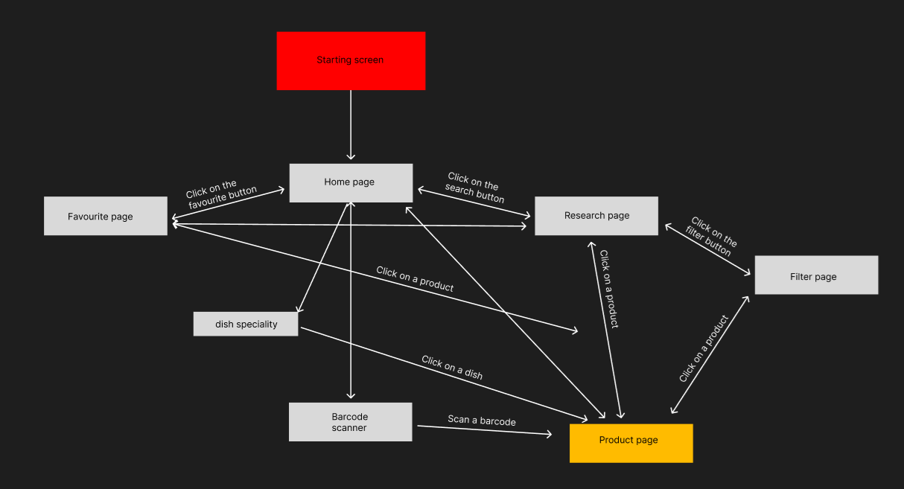
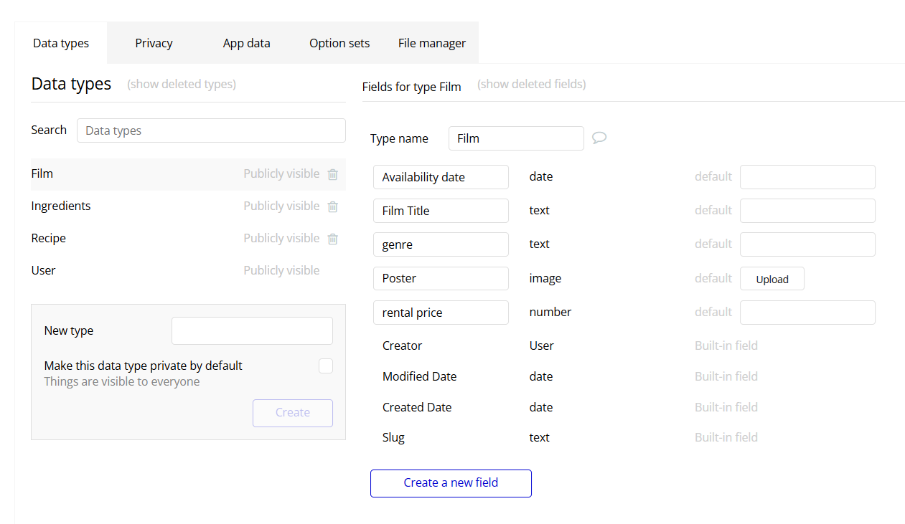

# Technical Specifications - Team 3 <!-- omit in toc -->

---

| Role | Name | Signature | Date |
|---|---|---|---|
| Project Manager | Léna DE GERMAIN | ✅ | 27/05/2025 |
| Program Manager | Camille GAYAT | ✅ | 27/05/2025 |
| Tech Lead | Julian REINE | ✅ | 27/05/2025 |
| Software Developer | Guillaume DESPAUX | ✅ | 27/05/2025 |
| Quality Assurance | Vivien Bistrel TSANGUE CHOUNGOU | ✅ | 27/05/2025 |
| Technical Writter | Lucas AUBARD | ✅ | 27/05/2025 |

This project's documents are registered under the [MIT License](https://en.wikipedia.org/wiki/MIT_License) that you can find [here](Document\TechnicalSpecifications\license.md)

## Table of Content <!-- omit in toc -->

- [I. Project Overview](#i-project-overview)
  - [1. Introduction](#1-introduction)
    - [1.1 Objectives](#11-objectives)
  - [2. Project Scope](#2-project-scope)
    - [2.1 In Scope](#21-in-scope)
    - [2.3 Out Of Scope](#23-out-of-scope)
  - [3. Task Management](#3-task-management)
  - [4. Development Environment](#4-development-environment)
    - [4.1 Technologies Used](#41-technologies-used)
    - [4.2 Naming Conventions](#42-naming-conventions)
    - [4.3 GitHub Repository Rules](#43-github-repository-rules)
      - [4.3.1 GitHub Commits](#431-github-commits)
        - [A. Commit Titles](#a-commit-titles)
        - [B. Commit Body](#b-commit-body)
        - [C. Examples](#c-examples)
      - [4.3.2 GitHub Comments](#432-github-comments)
    - [4.5 File and folder architecture](#45-file-and-folder-architecture)
- [II. Technical Aspect](#ii-technical-aspect)
  - [1. Application Overview](#1-application-overview)
    - [1.1 Front-End Specifications](#11-front-end-specifications)
      - [A. **Main Page**](#a-main-page)
      - [B. **Filter Page**](#b-filter-page)
      - [C. **Research Page**](#c-research-page)
      - [D. **Product Page**](#d-product-page)
      - [E. **Favorites Page**](#e-favorites-page)
    - [1.2 Application Architecture](#12-application-architecture)
    - [1.3 Backend Overview (Workflow)](#13-backend-overview-workflow)
      - [A. Trigger/Event](#a-triggerevent)
      - [B. Series of Actions](#b-series-of-actions)
      - [C. Conditions](#c-conditions)
  - [2. Database structure](#2-database-structure)
    - [2.1 Database breakdown](#21-database-breakdown)
    - [2.2 Bubble Database breakdown](#22-bubble-database-breakdown)
      - [A. Data Types](#a-data-types)
      - [B. Fields](#b-fields)
      - [C. Things](#c-things)
      - [D. Relationships](#d-relationships)
    - [2.3 API database](#23-api-database)
      - [A. Data Pull](#a-data-pull)
        - [A.1. Data Isn’t Stored in Bubble](#a1-data-isnt-stored-in-bubble)
        - [A.2 API Connector](#a2-api-connector)
        - [A.3 Data Usage](#a3-data-usage)
        - [A.4 Data Connection to Bubble](#a4-data-connection-to-bubble)
      - [B. Data Push](#b-data-push)
        - [B.1. How This Maps in Bubble](#b1-how-this-maps-in-bubble)
      - [C. Unique ID](#c-unique-id)
  - [3. Bubble building features breakdown](#3-bubble-building-features-breakdown)
    - [3.1 Bubble introduction](#31-bubble-introduction)
      - [A. Visual Editor (Design Tab)](#a-visual-editor-design-tab)
      - [B. Workflow Editor](#b-workflow-editor)
      - [C. Database (Data Tab)](#c-database-data-tab)
      - [D. Plugins](#d-plugins)
      - [E. API Connector](#e-api-connector)
      - [F. Responsive Engine](#f-responsive-engine)
      - [G. Custom States](#g-custom-states)
      - [H. Version Control \& Deployment](#h-version-control--deployment)
      - [I. SEO and Hosting](#i-seo-and-hosting)
    - [3.2 Bubble Offline usage](#32-bubble-offline-usage)
      - [3.2.1 Initial Content Load](#321-initial-content-load)
      - [3.2.2 Data \& Workflows](#322-data--workflows)
  - [4. Wine and Cheese Algorithm](#4-wine-and-cheese-algorithm)
    - [4.1 Firebase database structure](#41-firebase-database-structure)
    - [4.2 Compatibility Level](#42-compatibility-level)
  - [5. Features usage](#5-features-usage)
    - [5.1 Language changer](#51-language-changer)
    - [5.2 Barcode scanner](#52-barcode-scanner)
  - [6. Bubble Limitations](#6-bubble-limitations)
    - [A. Performance and Scalability](#a-performance-and-scalability)
    - [B. Platform Dependency](#b-platform-dependency)
    - [C. Design \& UI Constraints](#c-design--ui-constraints)
    - [D. Logic Limitations](#d-logic-limitations)
    - [E. Cost Considerations](#e-cost-considerations)
    - [F. Security](#f-security)
    - [G. API and Integration Limitations](#g-api-and-integration-limitations)
    - [H. Not Ideal for Certain Use Cases](#h-not-ideal-for-certain-use-cases)
- [III. Development Process](#iii-development-process)
  - [1. Development rules](#1-development-rules)
  - [2. Risks and Mitigation Strategies](#2-risks-and-mitigation-strategies)
  - [3. Testing](#3-testing)
    - [3.1 Testing Strategy](#31-testing-strategy)
    - [3.2 Scalability and Performance](#32-scalability-and-performance)
  - [4. Future Improvements](#4-future-improvements)
  - [5. Glossary of Key Terms](#5-glossary-of-key-terms)

---

# I. Project Overview

## 1. Introduction

Welcome to this year's **fifth** project, the project **bubble intermarché**.
This project is **a commission** from [Intermarché](https://www.intermarche.com/accueil), a French grocery store brand, especially the intermarché from *Saint-Rémy-de-Provence*.

This project aims to develop a **working interface** using the no-code engine **bubble**, showing the possible combination between wines and cheeses. The target users include:

- Tourists and users who want to learn more about the French gastronomic culture.

### 1.1 Objectives

Saint-Rémy-de-Provence is a highly **touristic** area in France. The local Intermarché supermarket asked us to develop a **functional interface** that could **showcase possible wine and cheese pairings**, based on both their current stock and traditional French gastronomy. The goal was to make these pairings more accessible to people around the world, with a special focus on the many tourists visiting the region.
The application will be able to **associate**, using a **custom database**, the different **wine and cheese combinations** with as well, **dish recommendations** (e.g: Boeuf bourguignon for the red wine).
The team will focus on creating a **user-intuitive interface** so everybody, even tourists who are not trained in computer science, can understand it fully and use it in its proper way.

---

## 2. Project Scope

Bubble will help us create a user-intuitive application, but we need to keep in mind the scope of the project to ensure a good workflow:

### 2.1 In Scope

- Wine/cheese recommendation.
- User-friendly interface.
- Complete filter of wine and cheese for the application.
- Scanning function to identify the product.

### 2.3 Out Of Scope

- Geolocalisation of the products on the store's shelves.
- shipping or delivery services.
- Creating new Wine/cheese pairings.
- Advanced settings functions.

---

## 3. Task Management

The project will be divided into the following tasks:

- User Interface: Creating an intuitive and interactive user interface for the wine and cheese pairing service.
- Bar code scanning: Creating the bar code scanning feature.
- Testing and Debugging: Testing the system for bugs, performance issues, and usability problems, and fixing them as soon as possible.
- Database creation/implementation: Creating the wine and the cheese databases based on the provided documentation.
- Documentation: Writing technical documentation, user guides, and other relevant documentation for the project.

The team will collaborate across all project tasks, with each member bringing their specific skills and expertise to different parts of the work. Regular meetings will be scheduled to review progress, share updates, and quickly resolve any challenges that may appear during development. Throughout the process, the team will also engage with the customer to gather feedback and confirm that deliverables meet expectations.

The project aims to be completed within the agreed timeline, with consistent updates provided to the customer to ensure the work stays aligned with their needs and requirements.

---

## 4. Development Environment

Our team uses multiple machines to work on this project, such as:

- 2 Windows running Windows 11.
- 4 MacBooks running MacOS 15 Sequoia

### 4.1 Technologies Used

During this project, we will use:

- [Bubble](https://bubble.io/home/): Bubble is a site making tool and a PaaS developed by Bubble Group. It can be used by people with limited or no programming experience to make pages.

- Bubble plugins:
  - Barcode scanner: A barcode scanner that will allow you to scan from any camera on your device! You can choose the camera from a list enumerated from your device and use that to scan barcodes, or choose 'Front' or 'Back' and allow the plugin to find the correct camera.
  - CSS loading animations: Loading.io's CSS spinner uses CSS Animation to create Loading and Preloading animations. These are supported by all modern browsers, such as Google Chrome and Mozilla Firefox.
  - Local storage & Cookies: Create cookies on the device's Local Storage to store information persistently.
  - API connector: The API connector lets you define your own API calls directly in the Bubble Editor and use them in your application.

### 4.2 Naming Conventions

The team will use **PascalCase** for folder structure and **camelCase** for file structure.

PascalCase offers **clarity and precision**, making it easy for users to quickly identify and distinguish the individual words in a document or file name. Words are joined without spaces, with each new word starting with a capital letter.
**Example of camelCase:**

``` technicalSpecifications.md ```

**Example of PascalCase:**

``` TechnicalSpecifications ```

### 4.3 GitHub Repository Rules

To maintain the **quality** of documents in both the main branch and release versions, we have **established** a set of rules.

The main branch is protected and only allows changes through pull requests. This ensures the branch remains free from unintended modifications. Each pull request must be approved by at least two team members.

#### 4.3.1 GitHub Commits

Commits must adhere to specific guidelines, most of which are outlined in this document [here](https://GitHub.com/FlowingCode/DevelopmentConventions/blob/main/conventional-commits.md).

##### A. Commit Titles

The title is a crucial part of any commit. It provides a concise summary of the changes, indicating what has been implemented, fixed, or removed. As such, it must comply with the following rules:

- **Clarity:** The title should accurately reflect the content of the commit.
- **Naming Convention:** It must follow the project's naming standard—PascalCase, in our case.
- **Professionalism:** Even if the commit is made in a document branch, the title should be free of grammar mistakes and written in clear, understandable language.

> [!NOTE]
> Additionally, titles should not exceed 50 characters. They must describe the action taken (using a verb) and include the name of the feature or file affected.

##### B. Commit Body

The body of a commit provides a more detailed explanation of the changes and, like the title, must follow specific guidelines:

- **Provide context:** Clearly explain why the change was necessary.
- **Summarize the changes:** Briefly describe how the changes were implemented, especially in cases of new features, fixes, refactoring, or optimizations.
- **Reference related issues:** Link to relevant issue numbers when applicable.
- **Keep it concise:** Avoid long paragraphs; use bullet points or short lines to list what was done.
- **Use clear language:** Avoid technical jargon unless it's explained—other contributors should be able to understand your commit easily.

> [!NOTE]
> The body can also contain specific keywords that can interact with the repository, such as adding co-authors, closing issues, etc. They can be found [there](https://GitHub.com/FlowingCode/DevelopmentConventions/blob/main/conventional-commits.md/#5-Footer) in the footer section.

##### C. Examples

This is a template for a correct commit:

```plaintext

[Type of change] (Quick summary) --> Title

[What you implemented] --> Body
- [Implementations].
- [Update].

```

#### 4.3.2 GitHub Comments

We follow GitHub standards to enhance readability, but without comments, understanding the commits can take longer than necessary.

To ensure that other team members can **collaborate effectively** and to support long-term maintenance, comments are essential.
Team members have to **follow the same rules** said before for the comment section to ensure the workflow stays understandable.

### 4.5 File and folder architecture

```bash
 2024-2025-project-5-bubble-intermarche-team-3
├──   Main
│        ├── Documents
│        │       │
│        │       ├──FunctionalSpecifications
│        │       │      ├── images
│        │       │      └── functionalSpecifications.md
│        │       │
│        │       ├── TechnicalSpecifications
│        │       │      ├── images
│        │       │      ├── conventions.md
│        │       │      ├── license.md
│        │       │      └── technicalSpecifications.md
│        │       │
│        │       ├── QualityAssurance
│        │       │      ├── images    
│        │       │      ├── testCase.md 
│        │       │      └── testPlan.md 
│        │       │
│        │       ├── UserManual
│        │       │      └── userManual.pdf
│        │       │
│        │       └── Management
│        │              ├── managementArtifacts
│        │              └── weeklyReports
│        │            
│        ├── .gitignore
│        └── README.md 
│              
├── Functional
│       ├── .GitHub/workflows // Automatically fetching every branch according to the main
│       ├── images
│       └── functionalSpecifications.md
│  
├── Management
│       ├── .GitHub/workflows // Automatically fetching every branch according to the main
│       ├── images   
│       ├── managementArtifacts
│       └── weeklyReports
│                     
├── QualityAssurance
│       ├── .GitHub/workflows // Automatically fetching every branch according to the main
│       ├── images    
│       ├── testCase.md    
│       └── testPlan.md 
│              
├── Technical       
│       ├── .GitHub/workflows // Automatically fetching every branch according to the main                        
│       ├── images
│       ├── technicalSpecifications.md
│       └── convention.md
│            
└── UserManual  
        ├── .GitHub/workflows // Automatically fetching every branch according to the main                        
        └── userManual.pdf
        

```

This GitHub architecture is unique in that, instead of using a shared documentation branch, each contributor has their own dedicated branch. This allows everyone to push their commits independently, reducing the risk of conflicts with other documents.

Additionally, we’ve implemented a GitHub workflow to automatically block commits if conflicts are detected.

---

# II. Technical Aspect

This is the **section where the technical aspect of the project** will be explained in detail. We will dive into all of the features of the project, how they work, and more specifications on them.

> [!Note]
> As we are using Bubble, there is no real back-end development. Bubble's functions for developing will be explained, but the document will not be able to provide you with further information on how every module works.

---

## 1. Application Overview

### 1.1 Front-End Specifications

Based on the mockups approved by the client, the front end will include the following pages:

#### A. **Main Page**

The main page allows users to view and interact with highlighted products.

- **Header:** Contains the navigation bar, barcode scanner, filter button, and language switcher.
- **Footer:** Includes navigation buttons for accessing different pages.
- **Page Content:** Displays the user’s selected products. Clicking a product redirects the user to the Research Page.

<p align="center">
  
</p>

---

#### B. **Filter Page**

This page lets users filter products based on specific criteria.

- **Header:** Expanded to include filter options. Users can search by product type (cheese or wine) or look for specific combinations.
- **Footer:** Same as the main page.
- **Page Content:** Similar layout to the main page, with filters added to the header. After selecting their filters, users are redirected to the Research Page.

<p align="center">
  
</p>

The Filter page works typically by using the unique ID each product has, and filtering them by criteria conditions. Each Unique ID will be associated with a product and a specification of the product, using the database template.

For example, if the user is looking for red wine, every unique ID with the Redwine criteria will be displayed, and the other will be omitted.

---

#### C. **Research Page**

The Research Page enables users to browse products based on their search or filter.

- **Header:** Remains unchanged.
- **Footer:** Remains unchanged.
- **Page Content:** Displays a list of matching products, including images. Clicking on a product takes the user to the product page.

<p align="center">
  
</p>

---

#### D. **Product Page**

This page shows detailed information about a selected product.

- **Header:** Remains unchanged.
- **Footer:** Remains unchanged.
- **Page Content:** Displays several product images, attribute tags, pricing information, recommended pairings (e.g., wine with cheese), and potential recipes using the product.

<p align="center">
  
</p>

---

#### E. **Favorites Page**

The favorites page allows users to manage their saved products.

- **Header:** Remains unchanged.
- **Footer:** Remains unchanged.
- **Page Content:** Lists all favorited products with their name, tags, and image. Users can remove items from their favorites or click on a product to view its detailed product page.

<p align="center">
  
</p>

>![Note]
> All of the pages will be translated from English to French using the language changer button due to core requirements for this project.

### 1.2 Application Architecture

The application will have all the pages interconnected so you can access them anytime.. Here is a simple breakdown of how the application is structured:

<p align="center">
  
</p>

### 1.3 Backend Overview (Workflow)

Bubble's workflow is the brain behind the intuitive user interface. You can see it as the backend of the project. Bubble workflows are mainly composed of:

#### A. Trigger/Event

The trigger event is a block that starts the workflow, such as:

- A button click.
- A page load.
- A user logging in.
- A custom event.
- An API workflow.

#### B. Series of Actions

These are executed sequentially, for example:

- Create a new thing (add to Bubble’s DB).
- Make an API call (to Firebase, for example).
- Show an element or “Navigate to another page”.

#### C. Conditions

Each action can run only when certain conditions are met, e.g.:

- Only if the Input's value is not empty.
- Only if the Current User's role is admin.
  
---

## 2. Database structure

Bubble provides a simple and efficient way to manage databases. Through the "Data" section of the platform, users can easily **add**, **modify**, and **retrieve** information from the database with minimal effort.

This section also allows you to view how the database is structured, including how various data types are interconnected and related to each other.


---

### 2.1 Database breakdown

In this database structure, each product is described with detailed specifications. For instance, when a wine is selected, all of its associated attributes will be displayed on the app's "product page."

The database is **read-only for users**—only the client will have permission to modify its content. All data will be entered **manually** by the client.

The data model is organized using **main classes**, with relationships established through **subclasses**. Both wines and cheeses have their own dedicated classes, allowing for clear identification and classification based on specific criteria.

Below is an example of how wine entries are structured in the database.

``` plaintext

%% ======= WINE DOMAIN ========

class Wine {
    +ean : String
    +itm : String
    +name : String
    +price : number
    +region : String
    +aop : bool
    +aoc : bool
    +igp : bool
    +cooking : bool
    +description : String
    +castle : String
    +quantity : number
    +sparkling : bool
    +style : WineStyle
    +image : blob
    +origin : Origin
}

```

| Statement   | Explaination |
|---------|----------------|
| Bool    | True / False Statement |
| String  | Text input statement  |
| Number  | Number input statement  |

This is the core class for all wine-related items.

**Identification:** ean, itm, name

**Commercial info:** price, quantity, castle, description, image

**Legal labels:** aop, aoc, igp (French certifications)

**Categorization:** style (linked to WineStyle), origin (linked to Origins)

**Usability:** cooking, sparkling flags

**WineStyle**: Represents the stylistic characteristics of a wine:

**name:** e.g., "Fruity Red", "Dry White"

**color:** e.g., red, white, rosé

**description:** extra info for pairing

**Origin**: Describes the wine’s geographic origin and image, used in both Wine and Cheese classes. This adds reusability and consistency.

The subcategories are connected together to those two categories, allowing the user to find the best wine/cheese combination when checking one of the criteria given.

---

### 2.2 Bubble Database breakdown

Bubble uses a built-in, no-code database that stores data in "data types", which are like tables in a **traditional** database. Each "data type" has Fields, which are like **columns**, and each Entry is a **row or object**.

<p align="center">
  
</p>

#### A. Data Types

- These are the main entities in our app.

```Example: User, Wine, Cheese, Pairing```

#### B. Fields

Each Data Type has fields — think of them as properties or attributes.

Types: text, number, date, yes/no, file, image, geographic address, another Data Type (for relationships), list of things.

```Example: Wine might have a field Type = red (text), Acidity Level = 4 (number)```

#### C. Things

- A "Thing" is a single entry in a Data Type, like a single wine.

#### D. Relationships

- Fields can reference other Data Types.

```Example: A Pairing can have a field Wine (type = Wine) and Cheese (type = Cheese)```

You can also have lists: e.g., User → SavedPairings (list of Pairings).

---

### 2.3 API database

Because Bubble database's **is limited**, we decided to use an API to upload our database and **bypass this limit**. We decided to use [Firebase](https://firebase.google.com/) to create our own API dataset.

#### A. Data Pull

##### A.1. Data Isn’t Stored in Bubble

**You're not creating Bubble database entries** (like internal records). Instead, you’re pulling data from Firebase, showing it in the app, or sending data back to Firebase.

It’s a live connection, so every time you show or update something, it makes an API call (unless you manually store it in Bubble’s database).

##### A.2 API Connector

The API Connector lets you define requests to external APIs (like the Firebase API we created):

- **GET** requests fetch data from Firebase.

- **POST/PATCH/DELETE** requests write or modify data in Firebase.

##### A.3 Data Usage

Works in one way unless you store it. Bubble can display this external data directly, but:

- You **can’t use** native filtering/searching on external data like you can using Bubble's database.

- You **can’t use** built-in privacy rules like the one used by Bubble. (**Firebase handles its own security**).

You’ll often want to **transform or cache** this data locally for performance or UI needs.

##### A.4 Data Connection to Bubble

With Firebase, data is protected via Firebase **security rules**. Which are separate from Bubble’s privacy system:
You must handle:

- **Auth tokens** (e.g., OAuth2 or Firebase custom tokens).

- **API key permissions**.

#### B. Data Push

In Firebase (specifically Cloud Firestore), you can **modify/add** elements to the database by:

- Creating a new document in a collection or updating an existing document.
This is done by making a **POST or PATCH HTTP** request to Firebase’s REST endpoint, depending on whether you're creating or updating.
  
##### B.1. How This Maps in Bubble

You can set, using the **API Connector plugin**, the api connection between **Bubble and Firebase**. The API is integrated following these patterns:

Method: ```GET```

URL: ```https://firestore.googleapis.com/v1/projects/YOUR_PROJECT_ID/databases```

Headers:

- Authorization: ```your_token```

- Content-Type:  ```application/json```

Body: ```Raw JSON```

#### C. Unique ID

In Firebase, every element will have an ID automatically generated, which will be the core for data retrieval.
The Unique ID will be linked to a product, and we will be able to call it and filter it using Bubble's functions.

---

## 3. Bubble building features breakdown

### 3.1 Bubble introduction

Bubble.io is a no-code platform that empowers users to create web applications without traditional coding. With its intuitive visual interface, it makes app development accessible to non-technical users while still offering advanced capabilities for experienced developers.
Bubble is built on an architecture designed to ensure high performance, security, and reliability. It uses these technologies:

- HTML/CSS: Provides the foundational structure and styling for the web interface.
- JavaScript: Powers client-side interactions and dynamic content.
- RESTful APIs: Facilitate communication between different services within the application.
- Node.js: Runs server-side JavaScript code to handle backend logic.

#### A. Visual Editor (Design Tab)

- Drag-and-drop UI builder for creating responsive layouts.
- Pre-built elements: text, buttons, inputs, repeating groups, icons, images, etc.
- Custom styling via Bubble's style manager.

#### B. Workflow Editor

- Logic engine to handle actions and events (e.g., when a button is clicked, sign up a user, navigate, show a message).
- Conditions and triggers (e.g., "Only when...").

#### C. Database (Data Tab)

- Built-in database for creating and managing custom data types (like tables) and fields.
- Includes a dev and live database, and supports privacy rules.

#### D. Plugins

- Extend functionality with third-party or Bubble-made plugins (e.g., API connector, Style animations, etc...).

> [!Note]
> You can also create your own plugins if needed.

#### E. API Connector

- Allows you to connect to external APIs (RESTful APIs) without writing code.
- Define API calls and use them in workflows or data sources.

#### F. Responsive Engine

- Helps design layouts that adapt to different screen sizes.
- Use conditionals and breakpoints to tweak mobile/tablet/desktop experiences.

#### G. Custom States

- Store temporary data on the front end (like UI state) without writing to the database.

#### H. Version Control & Deployment

- Built-in version control, including autosave and deployment from dev to live.
- Ability to create “development versions” for testing.
- Security & Privacy Rules.
- Fine-grained privacy controls for data access.
- Set rules per data type for who can view/edit/delete entries.

#### I. SEO and Hosting

- Built-in hosting, with options to add meta tags, custom domains, and SSL.
- Support for SEO-friendly URLs and content.

### 3.2 Bubble Offline usage

In order for the application to work offline, Bubble must work offline after loading for the first time, the main elements. Here is a list of what will and will not work offline.

#### 3.2.1 Initial Content Load

When a user first visits your app:

- The Bubble building elements get cached by the browser.

This means static content (like images or previously loaded pages) might still be visible if the user loses connection after the app has loaded.

#### 3.2.2 Data & Workflows

However:

- Dynamic content (database queries, workflows, updates) will not function offline.

If the app tries to pull new data or run server-side workflows, it will fail without a connection.

---

## 4. Wine and Cheese Algorithm

The core purpose of the app is to match wines with cheeses, so we need a fast and reliable algorithm to handle these pairings efficiently.

To support this, the main algorithm will use a Firebase database instead of Bubble’s built-in database, which is limited to 200 entries per project.

### 4.1 Firebase database structure

Here is how the database on Firebase will use the data:

<p align="center">
  
</p>

- Each food sub-category has a unique ID, which is used to reference it within the application.
- In Bubble, you simply need to set up an API call to Firebase, which will fetch the relevant data using these unique IDs.
- All necessary data is stored in Firebase, including the wine and cheese pairing scale and other related information.

### 4.2 Compatibility Level

Products in the database are rated on a compatibility scale from 0 to 2, with 0 meaning not compatible, and 2 indicating items that should always be paired together. We followed this guide to accurately link each product to its ideal wine pairings:

<p align="center">
  
</p>

We linked each product’s unique ID to its compatibility level, allowing us to easily retrieve a product and determine which wines it pairs well with.

For cheese compatibility, we used the same approach, based on the following chart:

<p align="center">
  
</p>

## 5. Features usage

### 5.1 Language changer

Bubble provides a useful feature to automatically change the language of the whole application from one to another using only one feature:

- Go to Settings > Languages in your Bubble editor.

- Add the languages you want your app to support. It should now create a bubble database named " App Text ". You can now modify your entries with the needed languages like this:

 ``` welcome_message = "Welcome" (EN), "Bienvenue" (FR), etc. ```

- In the design editor, when inserting text, use "Insert dynamic data > App text" and select the entry you created. ( for example, the welcome_message).

### 5.2 Barcode scanner

We used a plugin in Bubble to correctly scan a product and redirect it to its page on the application. It's done using the barcode scanner plugin.

The scanner is using the ITM8 naming system of Intermarché. It means that this ITM8 number refers to a barcode in the application. In other words, it's automatically linked to Intermarché's stock.

## 6. Bubble Limitations

### A. Performance and Scalability

- Slower than code: Apps built on Bubble can be slower than those built with traditional coding, especially under heavy user load or with complex workflows.
- Limited backend control: You don’t have full access to the server infrastructure, which can restrict optimization.

### B. Platform Dependency

- Proprietary system: Your app is tied to Bubble. Migrating away from Bubble (e.g., to a custom codebase) can be difficult and time-consuming.
- No access to source code: You can’t export your app as traditional code, which limits flexibility and control.

### C. Design & UI Constraints

- Less pixel-perfect control: While Bubble offers a visual editor, it can be hard to match customized or complex UI designs with precision.
- Responsiveness issues: Making apps responsive across devices (especially mobile) can be tricky and time-consuming.

### D. Logic Limitations

- Workflow complexity: Workflows can get messy and hard to manage or debug.
- Limited debugging tools: Bubble’s built-in debugger is basic compared to traditional development environments, which can make troubleshooting more difficult.

### E. Cost Considerations

- Pricing scales: As your app grows in terms of users, data, or features, Bubble’s pricing can become expensive compared to hosting a custom-coded app.
- Third-party plugin dependence: Many advanced features rely on paid or community-built plugins, which may not always be free.

### F. Security

- Limited control over security implementation: Bubble handles much of the security for you, but this means you can't fully customize security protocols.
- No custom server logic: Implementing sensitive or custom backend logic may not be possible without using external services.

### G. API and Integration Limitations

- Limited flexibility with APIs: While Bubble supports REST and some others, integrating with complex or non-standard APIs may require more work.

### H. Not Ideal for Certain Use Cases

- Real-time apps with heavy data sync may hit performance bottlenecks.
- Highly specialized features or unique algorithms may not be easily implemented without external code or services.

---

# III. Development Process

## 1. Development rules

To maintain quality and consistency, the following rules will be followed:

- **Test Before Implementing:** Features are first tested in an isolated Bubble environment (Like a blank page). Only once verified will they be merged into the main project.
- **No-Code Review:** All changes are peer-reviewed within Bubble to ensure adherence to best practices and project standards.
- **Cross-Platform Testing:** The application will be tested across various devices and browsers to ensure accessibility and responsiveness.

---

## 2. Risks and Mitigation Strategies

During development, the project may encounter a range of risks, including technical limitations, resource constraints, and scheduling issues. To address these proactively, the team has outlined the following mitigation strategies:

1. **Technical Limitations**: Challenges related to Bubble’s no-code capabilities or integration restrictions may arise. To mitigate this, the team will perform in-depth research, utilize online documentation and forums, and consult experts when necessary to find workarounds and solutions.
2. **Resource Availability**: Limited access to certain Bubble features or external dependencies could hinder development. The team will manage this risk by collaborating closely with intermarché's stakeholders, prioritizing essential features, and seeking external support or workarounds when needed.
3. **Timeline Delays**: Unexpected setbacks such as technical hurdles, evolving requirements, or limited team availability may delay progress. To reduce this risk, the team will maintain clear communication, monitor project milestones, and revise schedules as necessary to stay aligned with delivery goals. To learn more about project management, check the "management" folder on our GitHub page.

By identifying these potential risks early and planning responsive mitigation strategies, the team aims to reduce disruptions and ensure the project stays on track for a successful and timely completion.

---

## 3. Testing

The testing part of the project will be done by **Manual Testing**, useful for exploratory testing, usability testing, and edge case scenarios that may not be covered by automated tests.

### 3.1 Testing Strategy

The testing strategy is built around key development principles to ensure the application's quality and stability throughout its lifecycle:

- **Test Early, Test Frequently**: Testing is integrated from the beginning of the development process. Unit tests will be written as components and functions are implemented.
- **Maximize Coverage**: The goal is to achieve high test coverage by focusing on core functionalities, edge cases, and potential error scenarios to ensure system resilience.
- **Regression Prevention**: Regular regression testing will be conducted to ensure new updates do not break or degrade existing features.
- **User-Focused Validation**: Usability, accessibility, and direct user feedback will be part of the testing workflow, ensuring a smooth and inclusive experience.

The QA will use their device to conduct tests on the application and render simulations for efficient testing. He will not be able to use the external test tool because of Bubble's security.

---

### 3.2 Scalability and Performance

The system will be engineered for scalability and performance, enabling it to handle complex operations, high data volumes, and significant user traffic. Key practices include:

- **Efficient No-Code Development**: Write clear and optimized no-code logic to reduce load and improve responsiveness.
- **Data Caching**: Use caching strategies within Bubble to reduce repetitive computations and speed up data access.
- **Lazy Loading**: Load only the components and data needed at runtime, improving load times and user responsiveness.
- **Robust Error Handling**: Gracefully manage unexpected errors, preventing application crashes and providing users with informative feedback.
- **Performance Monitoring**: Utilize monitoring tools and analytics to measure performance, detect bottlenecks, and continuously improve.
- **Load Testing**: Simulate high traffic conditions to assess how the system behaves under pressure and identify scalability limitations.

By following these practices, the application will be built to scale, perform efficiently, and provide a seamless user experience.

---

## 4. Future Improvements

Below is a list of potential enhancements that could be considered for future development:

- **Upgrading to a better plan in Bubble:** We are currently running on the free version of Bubble to present to you our application, but Bubble offers various paid plans, including useful features that remove the limitations we had during this project.
- **Generalisation of the project:** Making it possible to link more Intermarché stores to enhance the French culture in other touristic regions of France.
- **Real-time stock count:** We could implement, using a real-time database of the product availability, create a tracking system to warn the user if the product they want is unavailable in the store they want to go to.
- **Personalized Recommendations:** Learn from user behavior: saved pairings, ratings, dislikes. Offering tailored suggestions based on past activity or taste preferences.
- **Online shopping system:** being able to buy the desired product directly from the application.

---

## 5. Glossary of Key Terms

| Term | Explanation |
|------|-------------|
| **Bubble** | A no-code  development platform used to create applications without traditional programming. |
| **API Connector** | A plugin in Bubble used to define and manage external API calls from within the no-code editor. |
| **API (Application Programming Interface)** | A way for applications to communicate and exchange data; used here to connect Bubble with Firebase. |
| **Firebase** | A backend-as-a-service platform by Google, used in this project to host the external database. |
| **No-code** | Development using visual interfaces instead of writing source code; Bubble is a no-code tool. |
| **Data Type** | A structured entity (like a database table) in Bubble used to define objects such as Wine or Cheese. |
| **Field** | A property of a data type, like "price" or "region" in a Wine entry. Comparable to columns in a spreadsheet. |
| **Thing** | A single entry or record in a Bubble data type (e.g., one specific wine). |
| **Workflow** | A series of actions in Bubble triggered by an event (like clicking a button), similar to backend logic. |
| **Trigger/Event** | The action that starts a workflow (e.g., page load, button click). |
| **Condition** | A rule that determines whether a workflow action should be executed (e.g., only if a user is logged in). |
| **Custom State** | Temporary front-end memory in Bubble used to store UI information without saving to the database. |
| **EAN / ITM** | EAN (European Article Number) and ITM (internal identifier) are used to uniquely identify products. |
| **Responsive Engine** | Bubble’s tool to ensure the application layout adapts to different screen sizes (mobile/tablet/desktop). |
| **Version Control** | System for managing and tracking changes in development; Bubble supports this natively. |
| **Privacy Rules** | Permissions in Bubble that control who can view or modify data. |
| **Data Caching** | Temporarily storing data for faster access and better performance. |
| **Repeating Group** | A UI element in Bubble used to display a list of things dynamically. |

###### Copyright (c) 2025 ALGOSUP <!-- omit in toc -->

---