# <h1 align="center"> Functional Specification </h1>

---

 
Created by: Camille GAYAT   Creation Date: 05/08/2025   Last update: 05/16/2025

---

## 1. Introduction

This document outlines the functional specifications for the development of a mobile-friendly web application for Intermarché Saint-Rémy-de-Provence. The application will provide wine and cheese recommendations to customers based on their culinary preferences or occasions. The project aims to enhance customer experience while increasing store revenue, particularly targeting tourists with high purchasing power in this touristic region.

### 1.1 Glossary

| Term | Definition | Link |
| ---- | ---------- | ---- |
|      |            |      |

### 2. Project Overview

The project consists of developing a no-code web application using Bubble that will serve as a digital sommelier and cheese expert for Intermarché customers. The application will be accessible via URL or QR code without requiring installation, ensuring quick and easy access for shoppers. It will operate offline and be available in French and English to accommodate both local shoppers and international tourists.

## 3. Project Definition

### 3.1 Our Vision for the Project

We envision creating an intuitive, user-friendly application that enhances the shopping experience at Intermarché Saint-Rémy-de-Provence by providing personalized wine and cheese pairing recommendations. The application will function as a virtual expert, helping customers discover products that complement their planned meals or occasions, thereby encouraging additional purchases.

The application must be extremely simple to use, as customers typically don't spend extensive time in a single department. It should deliver quick, relevant recommendations within seconds, optimized for shoppers who are already using their smartphones while shopping.

### 3.2 Objectives to Reach

1. **Business Objective**: Increase store revenues by recommending wines and cheeses.
2. **Customer Service Objective**: Improve customer experience by providing expert pairing advice
3. **Technical Objectives**:
   - Create an offline-capable web application accessible via URL or QR code.
   - Develop the application in Bubble no-code platform.
   - Support multiple languages (French and English minimum).
   - Integrate barcode scanning functionality.
   - Provide accurate product recommendations.
   - Ensure intuitive, rapid user experience requiring minimal interaction.

### 3.3 Target Audience

The primary target audiences for this application are:

1. **Local French Customers**: Regular shoppers who may want to elevate their dining experience with better wine and cheese pairings.
2. **International Tourists**: Visitors with high purchasing power who want to explore authentic French products but may lack expertise in French wines and cheeses.
3. **Culinary Enthusiasts**: Shoppers planning special meals or events who want to impress guests with appropriate pairings coming from other countries.

#### 3.3.1 Personas

  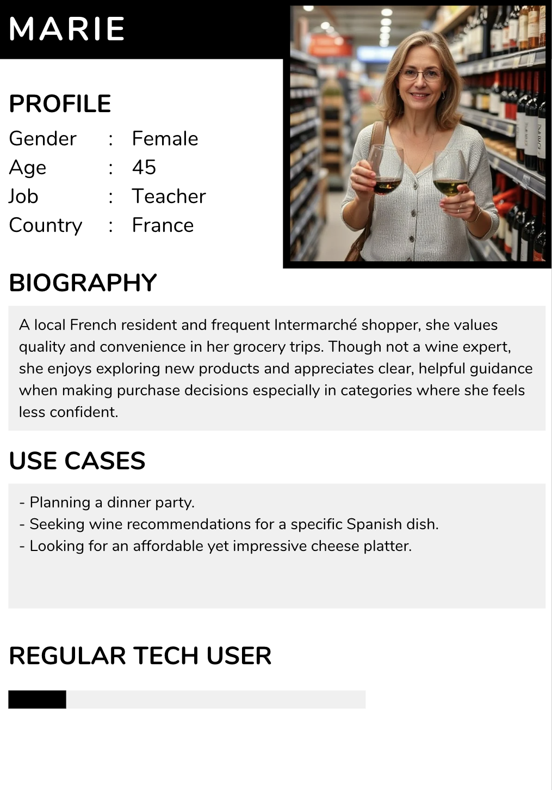
  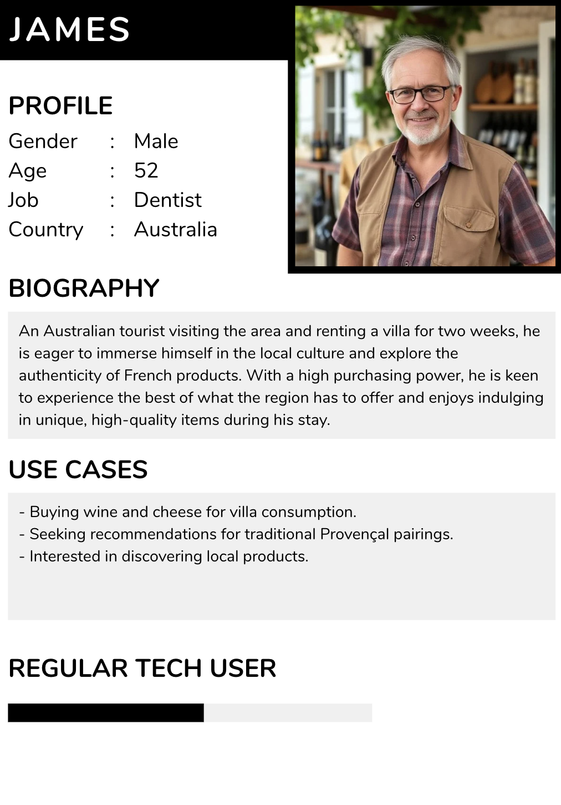
  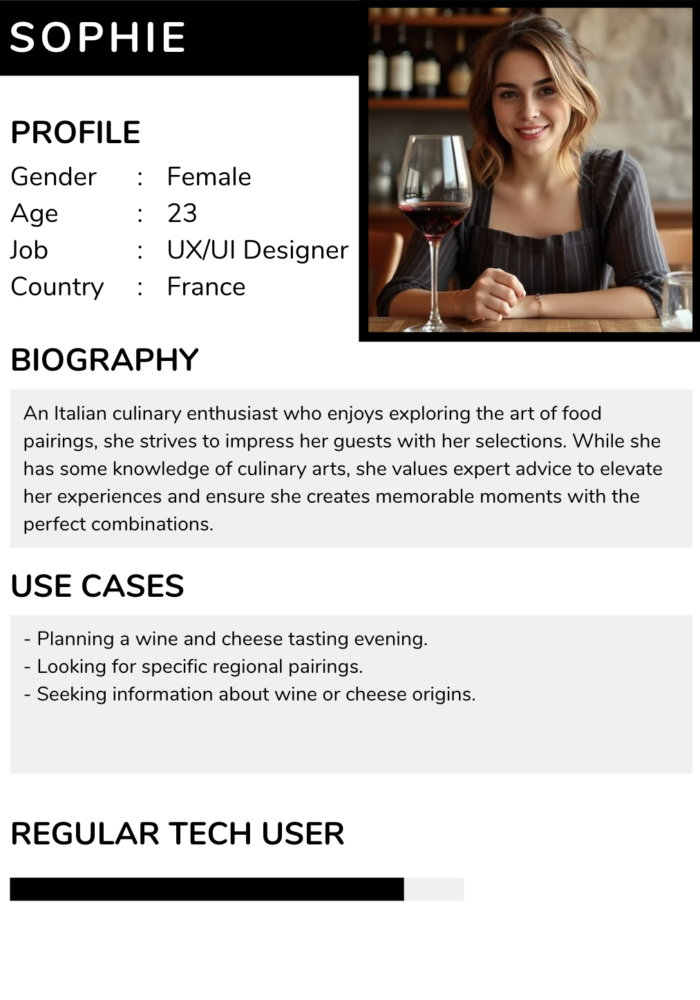

### 3.4 Prioritization

#### 3.4.1 MoSCoW Table

| Priority    | Description                                                                                                             |
| ----------- | ----------------------------------------------------------------------------------------------------------------------- |
| Must have   | Features that are critical to the project's success. Without these, the application would not meet its core objectives. |
| Should have | Important features that add significant value but are not critical to the basic functioning of the application.         |
| Could have  | Desirable features that would enhance the user experience but could be postponed if necessary.                          |
| Won't have  | Features that are explicitly excluded from the current development scope.                                               |

| Must have                                                                                        | Should have                                                                        | Could have                                                   | Won't have                                                                          |
| ------------------------------------------------------------------------------------------------ | ---------------------------------------------------------------------------------- | ------------------------------------------------------------ | ----------------------------------------------------------------------------------- |
| - Application available in French and English.                                                   | - A scanner to help users reaching their desired products easily within the store. | - Other languages to make the application more accessible.   | - A user account, this is a waste of time for the application and for the customer. |
| - Wine and cheese recommendation according to the selected dish.                                 | - Manage internet loss.                                                            | - Product management feature to ignore unavailable products. | - Have specific settings such as dark and light modes.                              |
| - User friendly, the user must make as few interactions as possible to reach an information.     | - Store date and avoid unecessary ones.                                                           |                                                              |                                                                                     |
| - A complete filter.                                                                             |                                                                                    |                                                              |                                                                                     |
| - Web app for a quicker and efficient use, it will be not necessary to download the application. |                                                                                    |                                                              |                                                                                     |

## 4. Deliverables

|       Deliverable        |    Date    |                                                  Purpose                                                  |
| :----------------------: | :--------: | :-------------------------------------------------------------------------------------------------------: |
| Functional specification | 16/05/2025 |             Documentation about the features of the application. Answer the question "What?".             |
| Technical specification  | 28/05/2025 | Documentation about the technical aspects of the application and the project. Answer the question "How?". |
|     Web application      | 16/06/2025 |              Mobile-friendly Intermarché Bubble application accessible via URL and QR code.               |
|        Test plan         | 06/06/2025 |                           Documentation about testing strategy of the project.                            |
|     Testing reports      |     /      |                          Constant reports about defects concerning the project.                           |
|       User manual        | 16/06/2025 |                             Documentation to help users to use the software.                              |

## 5. Project Members

### 5.1 Team Members

|              Name               |        Role        |                                       Role Description                                       |                                           LinkedIn & GitHub Links                                           |
| :-----------------------------: | :----------------: | :------------------------------------------------------------------------------------------: | :---------------------------------------------------------------------------------------------------------: |
|         Lena DE GERMAIN         |  Project Manager   | Oversees overall project planning, scheduling, resource allocation, and client communication |       [LinkedIn](https://www.linkedin.com/in/léna-de-germain/) / [GitHub](https://github.com/lenadg18)        |
|          Camille GAYAT          |  Program Manager   | Responsible for functional specifications, requirement gathering, and feature prioritization |   [LinkedIn](https://www.linkedin.com/in/camille-g-a89114293/) / [GitHub](https://github.com/CamilleGayat)    |
|          Julian REINE           |  Technical Leader  |   Provides technical guidance, architecture decisions, and oversees implementation quality   |  [LinkedIn](https://www.linkedin.com/in/julian-reine-b2952632a/) / [GitHub](https://github.com/JulianREINE)   |
|        Guillaume DESPAUX        | Software Developer |                Implements application features using Bubble no-code platform                 |  [LinkedIn](https://www.linkedin.com/in/guillaume-despaux/) / [GitHub](https://github.com/GuillaumeDespaux)   |
| Vivien Bistrel TSANGUE CHOUNGOU | Quality Assurance  |     Designs and executes test cases, ensuring application quality and proper functioning     | [LinkedIn](https://www.linkedin.com/in/bistrel-tsangue-603635261/) / [GitHub](https://github.com/Bistrel2002) |
|          Lucas AUBARD           |  Technical Writer  |          Creates documentation, user guides, and ensures clarity of specifications           |         [LinkedIn](https://www.linkedin.com/in/lucasaubard/) / [GitHub](https://github.com/LucasAub)          |

### 5.2 Client and School Representatives

| Name   | Role                                | Expectations                                                                                                         |
| ------ | ----------------------------------- | -------------------------------------------------------------------------------------------------------------------- |
| Chrys  | Intermarché representativ (Client)  | A working demo of the application easy to use that recommends wines and cheeses based on what the user wants to eat. |
| Célia  | Intermarché representative (Client) | A working demo of the application easy to use that recommends wines and cheeses based on what the user wants to eat. |
| Franck | School director                     | The academic requirements are met project aligns with learning objectives.                                           |

## 6. Development Planning

### 6.1 Task Dependencies

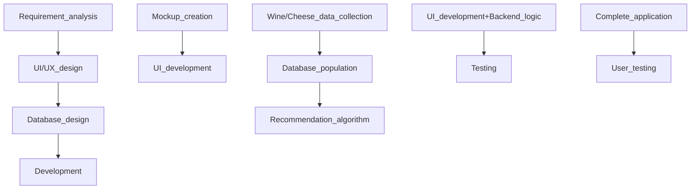

### 6.2 Assumptions and Constraints

1. **Assumptions**:
   - Internet connection available for initial loading of the application.
   - Users have smartphones.
   - Intermarché will provide access to product information.
   - Customers will be willing to use their smartphones while shopping.

2. **Constraints**:
   - Must work offline after initial loading
   - No user accounts or complex authentication
   - Limited development time (demo/proof of concept)
   - Must operate on diverse mobile devices
   - Performance must be fast for quick in-store use
   - Must be developed using Bubble no-code platform

### 6.3 Risks and Mitigation

| **Risk**                                                                     | **Impact**                                                                                            | **Likelihood**                                        | **Mitigation Strategy**                                                                                                                                                       |
| ---------------------------------------------------------------------------- | ----------------------------------------------------------------------------------------------------- | :-----------------------------------------------------: | ----------------------------------------------------------------------------------------------------------------------------------------------------------------------------- |
| **Offline Functionality Limitations**                                        | Users may not access recommendations due to offline limitations in Bubble, harming UX and usefulness. |      | Preload essential data (wines, cheeses, pairings) during the initial session; use Bubble's local storage and caching techniques to simulate offline support.                  |
| **Overly Complex User Journey**                                              | Shoppers may abandon the app if interaction requires too many steps or decisions.                     |  | Ensure a streamlined 2–3 step interaction max; apply usability testing during development; build flows based on typical supermarket behavior and time constraints.            |
| **Barcode Scanner Integration Not Working Reliably**                         | Could lead to frustration or failure to retrieve product recommendations.                             |  | Provide a fallback manual search/filter option; limit scanner usage to supported barcode formats; perform extensive device testing.                                           |
| **Incorrect or Irrelevant Product Recommendations**                          | Damages user trust and reduces likelihood of purchase.                                                |  | Curate and test recommendation algorithms manually; leverage expert input for pairings; maintain a QA-approved dataset; gather feedback through test scenarios.               |
| **Language Barriers Due to Incomplete Translation or Cultural Misalignment** | Tourists may not understand pairing suggestions or interface labels.                                  |  | Use native French and English translators; validate terminology through user testing with locals and tourists; clearly flag missing translations in dev to fix before launch. |
| **Poor Performance on Low-End or Old Smartphones**                           | Reduces app usability for a portion of customers, especially older tourists.                          |  | Optimize Bubble performance through simple UI, compressed images, and minimized workflows; test across a variety of devices before launch.                                    |
| **Bubble Platform Limitations Affecting Custom Logic or Future Scaling**     | Functional limitations (e.g., filtering, offline logic) may hinder advanced features or adaptation.   |        | Design within Bubble’s known capabilities; create simple, testable workflows; document limitations early to pivot if needed.                                                  |

## 7. UI/UX Design

### 7.1 Mockup

When visiting the supermarket, the user will have two options for accessing the application. The first is by entering the URL directly into a web browser. Alternatively, and more conveniently, the user can scan a QR code displayed on in-store flyers using their smartphone, which will instantly launch the web application.

---

#### 7.1.1 Loading Page

Loading page

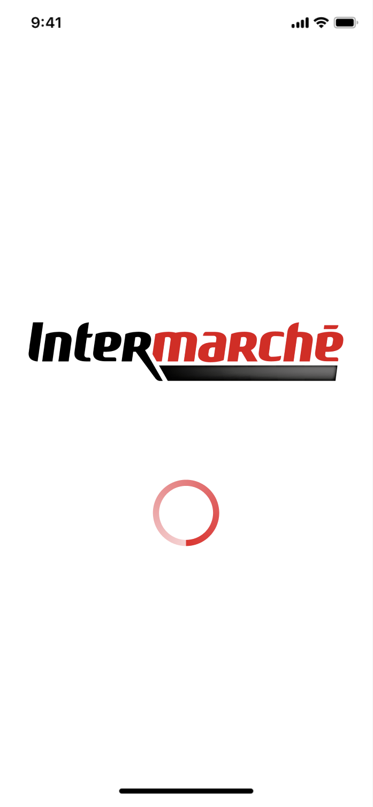

This mockup serves as a brief loading page. Its purpose is to give the application time to initialize and retrieve the necessary data before directing the user to the main interface.

---

#### 7.1.2 Main Page

Main page

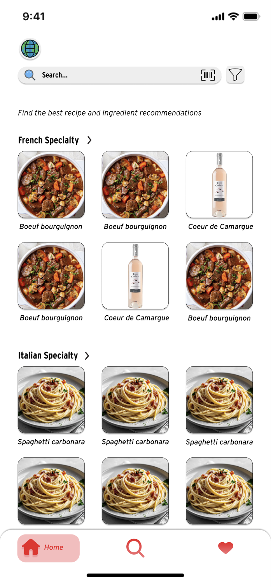

Once the application has finished loading or when the user taps the home button located at the bottom of the screen they will be directed to the main page. Here, all available recipes and ingredients, including wines and cheeses, are organized by country. Within each category, the user can horizontally scroll to explore additional items and select any product to view its detailed information. If the user does not find something of interest, they can utilize the navigation bar, the barcode scanner, or the filter option located at the top of the interface to refine their search.

---

#### 7.1.3 Research Page

Research page

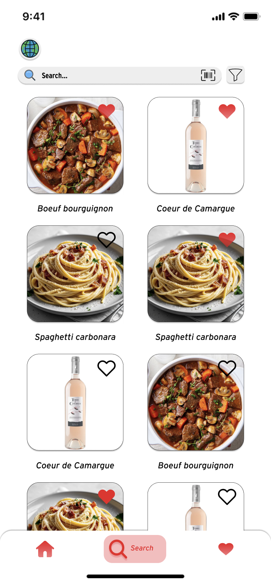

After performing a search, applying filters, or tapping the search button at the bottom of the screen, the user is directed to this page, where products related to their query are displayed. If the user wishes to save an item for later, they can tap the heart icon to add it to their favorites.

---

#### 7.1.4 Product Page

Product page

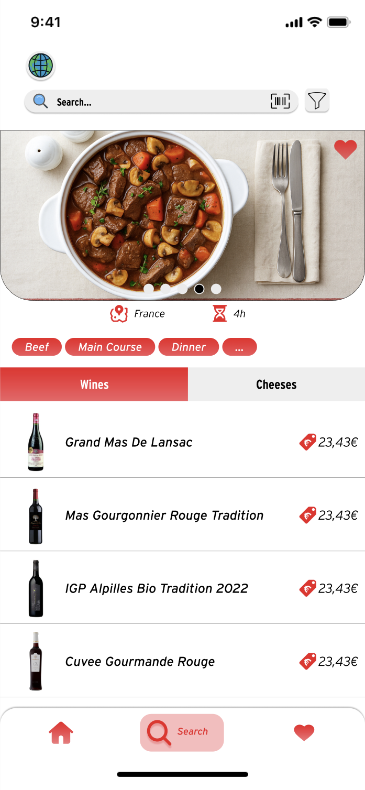
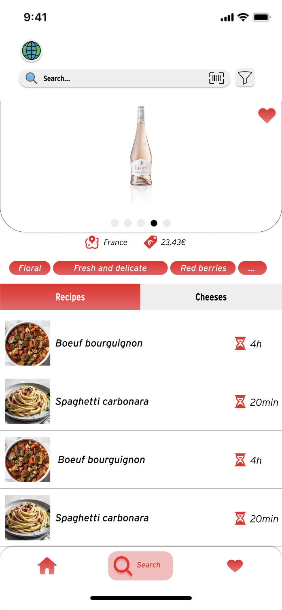

After selecting a product, the user is taken to a detailed view. By swiping horizontally on the image, they can browse additional photos showing the item from different angles. Key information is presented on this page, including the product’s country of origin, relevant category labels, and either the preparation time (for recipes) or the price (for wines and cheeses), depending on the item type. Toward the middle of the screen, two buttons are available, one for wines and another for cheeses. Based on the user’s selection, the application will suggest complementary ingredients that pair well with the chosen recipe, or conversely, recommend suitable recipes when an ingredient has been selected.

---

#### 7.1.5 Filter Page

Filter page

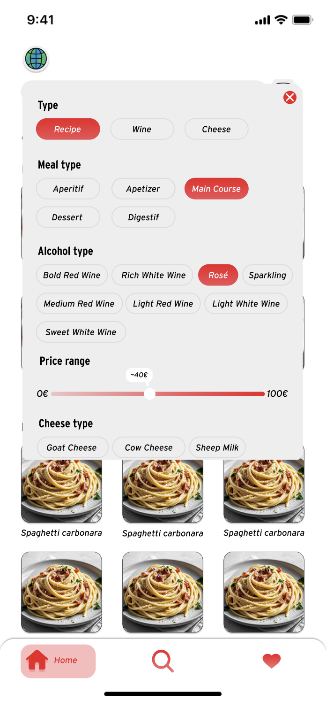

By tapping the filter button, the user can refine their search using various criteria, including meal type, cheese variety, wine type, and price range.

---

#### 7.1.6 Favorite Page

Favorite page

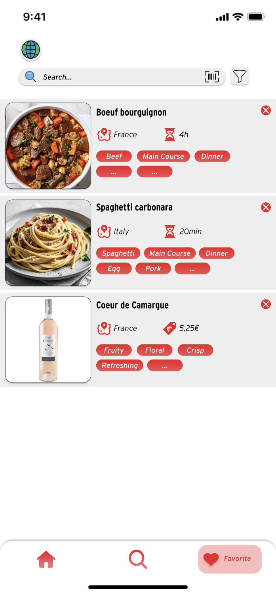

By tapping the favorite button at the bottom of the page, the user will be directed to the Favorites page, where they can save recipes and ingredients they like or wish to keep for later.

---

#### 7.1.7 Barcode Scanner Page

Barcode scanner page

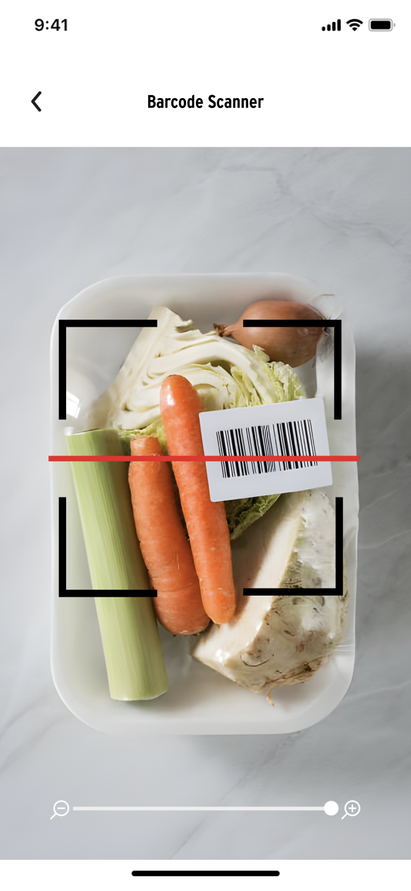

By tapping the barcode scanner button, the user can scan a product's barcode within the store to find it in the application.

---

### 7.2 Color Palette

|           Usage           |   Color name    |                               HEX                                |                            Gradient                             |  Opacity   |                                                           Notes                                                           |
| :-----------------------: | :-------------: | :--------------------------------------------------------------: | :-------------------------------------------------------------: | :--------: | :-----------------------------------------------------------------------------------------------------------------------: |
|       Primary color       |   Scarlet red   | #ED1D24  | #ED1D24 | 70% > 100% |                  This color is used to represent primary actions, including buttons, icons, and labels.                   |
|      Secondary color      | Very light gray |  #EEEEEE |                                X                                |    100%    | These colors are used to indicate secondary actions, such as unpressed buttons, navigation bars, and background elements. |
|       Neutral color       |      White      |  #FFFFFF |                                X                                |    100%    |                                        A neutral color used for most backgrounds.                                         |
| Unselected labels stroke  |   Light gray    |  #D9D9D9 |                                X                                |    100%    |                            Color used for the border of an unselected label within the filter.                            |
| Footer buttons background |   Scarlet red   |  #ED1D24 |                                X                                |    30%     |                          Color used for the background of the navigation buttons in the footer.                           |
|        Text color         |      Black      |  #000000 |                                x                                |    100%    |                                                                                                                           |

### 7.3 Font

Based on Intermarché's official brand typography guidelines:

**Application fonts:**

| Name      | Font             | Size |
| --------- | ---------------- | ---- |
| Titles    | Interstate Cond  | 40   |
| Subtitles | Interstate Light | 35   |
| Text      | Interstate       | 30   |

> [!NOTE]
> - Interstate should be used for all application interfaces when possible.
> - Use predefined font sizes and weights to ensure visual hierarchy.
> - Maintain adequate spacing between text elements for clarity.

### 7.4 Image Assets

---

<b>Intermarché logo</b>

Intermarché logo used in the loading page.

<b>Loading circle</b>

Loading circle used in the loading page.

- Color:  #ED1D24

- Opacity: 20% > 100%

<b>Favorite button</b>

Favorite button located in the application’s footer, is used to access the Favorites page and to indicate whether a product has been marked as a favorite.

- Color:  #ED1D24

- Opacity: 100% > 60%

<b>Empty favorite button</b>

Empty favorite button displayed when a product has not been marked as a favorite.

- Color:  #000000

- Opacity: 100%

<b>Pressed favorite button</b>

Pressed favorite button located in the application's footer.

- Color:  #ED1D24

- Opacity: 100%

- Shadow:

<ul>
   <li>X: 0</li>
   <li>Y: 8</li>
   <li>Blur: 4px</li>
   <li>Color:  #ED1D24</li>
   <li>Opacity: 25%</li>
</ul>

<b>Home button</b>

Home button located in the application's footer.

- Color:  #ED1D24

- Opacity: 100% > 60%

<b>Pressed home button</b>

Pressed home button located in the application's footer.

- Color:  #ED1D24

- Opacity: 100%

- Shadow:

<ul>
   <li>X: 0</li>
   <li>Y: 8</li>
   <li>Blur: 4px</li>
   <li>Color:  #ED1D24</li>
   <li>Opacity: 25%</li>
</ul>

<b>Search button</b>

Search button located in the application's footer.

- Color:  #ED1D24

- Opacity: 100% > 60%

<b>Pressed search button</b>

Pressed search button located in the application's footer.

- Color:  #ED1D24

- Opacity: 100%

- Shadow:

<ul>
   <li>X: 0</li>
   <li>Y: 8</li>
   <li>Blur: 4px</li>
   <li>Color:  #ED1D24</li>
   <li>Opacity: 25%</li>
</ul>

<b>Language button</b>

The button to modify the language.

<b>Search icon</b>

Icon located in the application's header inside of the search bar.

<b>Barcode scanner button</b>

Barcode scanner button.

- Color:  #000000

<b>Filter button</b>

Filter button.

- Color:  #000000

<b>Expand button</b>

Button used to expand the content of a category.

- Color:  #000000

<b>Go back button</b>

Button employed to navigate back to the previous page.

- Color:  #000000

<b>Close button</b>

Button used to close a window or remove an element.

- Color:  #ED1D24  #FFFFFF

<b>Country icon</b>

Icon employed to indicate the country of origin of the product.

 #ED1D24

<b>Preparation time icon</b>

Icon utilized to show the preparation time of a recipe.

 #ED1D24

<b>Price icon</b>

Icon used to indicate the price of a product.

 #ED1D24

### 7.5 User Flow

The following user flow illustrates the various paths available within the application, guiding the user from the initial launch of the web application to receiving personalized recommendations for wines, cheeses, or recipes based on their search inputs.

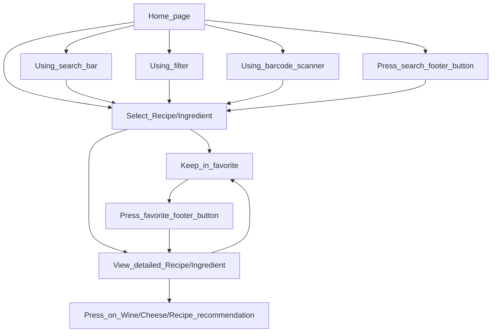

## 9. Functional Requirements

### 9.1 Core Features

1. **Multi-language Support**:
   - The application will be translated in 2 languages:
     - English
     - French
   - Other languages could be added in the future but are not mandatory.

2. **Navigation System**:
   - Bottom navigation bar with home, search, and favorites icons.
   - Tab navigation for switching between categories (Wines, Cheeses, Recipes).
   - Back button for nested screens.
   - Clean, flat design with minimal depth.

3. **Product Search**:
   - Prominently displayed search bar at top of interface.
   - Filtering via dedicated filter icon with comprehensive filtering page.
   - Category-based browsing.

4. **Barcode Scanner**:
   - Dedicated scanner page with camera interface.
   - Visual indication of scanning area.
   - Quick access to product details post-scan.

5. **Recommendation Engine**:
   - Category-based recommendations on home screen.
   - Wine and cheese pairings based on selected recipes.
   - Recipe suggestions based on selected wines/cheeses.
   - Display of prices to aid purchase decisions.

6. **Filter System**:
   - Meal type filtering.
   - Wine type filtering.
   - Cheese type categorization and filtering.
   - Origin filtering.

Filter Criteria Available in the Application:

| Category       | Description                                                                                                          |
| -------------- | -------------------------------------------------------------------------------------------------------------------- |
| Type           | Recipe, Wine, Cheese                                                                                                 |
| Meal type      | Aperitif, Apetizer, Main course, Dessert, Digestif                                                                   |
| Origin         | France, Italy, Spain                                                                                                 |
| Diet           | Vegetarian, Vegan, Gluten-Free, Lactose-Free, Halal, Kosher                                                          |
| Local products | Yes, No                                                                                                              |
| Alcohol type   | Bold red wine, Medium red wine, Light red wine, Rich white wine, Light white wine, Sweet white wine, Rosé, Sparkling |
| Cheese milk    | Goat milk, Cow milk, Sheep milk, Buffalo milk, Mixed milk                                                            |
| Cheese texture | Soft, Semi-soft, Hard, Crumbly, Creamy                                                                               |
| Price range    | ~0-100€                                                                                                              |

1. **Favorites System**:
   - Heart icon for adding items to favorites.
   - Dedicated favorites page for saved items.
   - Favorites accessible from main navigation.

2. **Visual Product Display**:
   - Card-based layout with high-quality food/product imagery.
   - Price display for products.
   - Origin indicator.
   - Consistent layout across different product types.

### 9.2 Product Catalogs

1. **Recipe Catalog**:
   - Featured prominently on main page and dedicated tabs.
   - Categorized by cuisine.
   - High-quality images for each recipe.
   - Origin indication.

2. **Wine Catalog**:
   - Price display.
   - Categories visible in filter.
   - Origin indication.
   - Recommendation context (which recipes they pair with).

3. **Cheese Catalog**:
   - Categorized by type.
   - Displayed alongside wine and recipes recommendations.
   - Filter options for cheese type.
   - Visual display on dedicated cheese tab.

4. **Organization System**:
   - Cross-referencing between catalogs.
   - Consistent card-based display across all product types.
   - Tabs for quick navigation between product types.
   - Filter system for refined browsing.

#### 9.2.1 Wine and Cheese Combinations

The following image illustrate ideal pairings between wines and cheeses, highlighting which types of wine pair best with specific foods and which cheeses complement different varieties of wine.

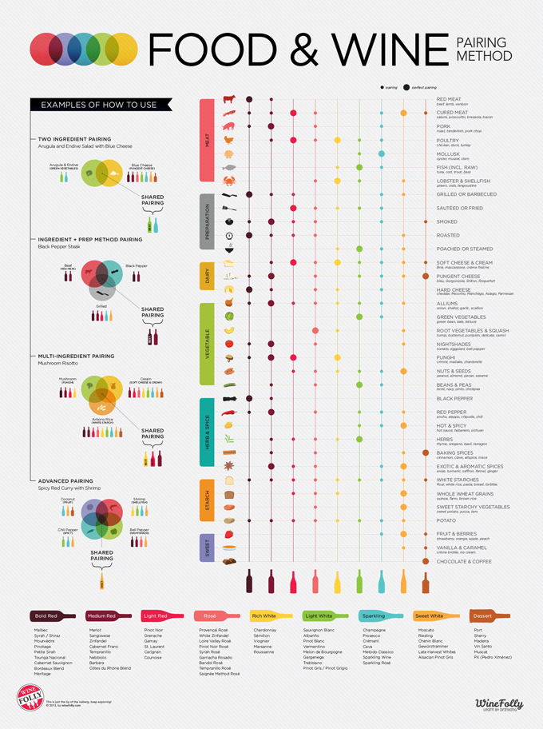

#### 9.2.2 Organized Catalog of Intermarché Best Sellers

Wines

Bold red

🟥 **Bold Red**:

*Full-bodied, high tannin, intense*:
- MAS DE LA DAME RÉSERVE DU RGE
- AOP CÔTES DU RHÔNE PRESTIGE LE SER
- CÔTES DU RHÔNE GUIGAL
- MAS GOURGONNIER ROUGE TRADITION
- MAS DE LA DAME LA STÈLE ROUGE
- CHÂTEAU MARQUIS DES B. (Bordeaux)
- CÔTES DU RHÔNE PERRIN ROUGE
- VENTOUX SECRET DE TRUFFE ROUGE
- AOP CÔTES DU RHÔNE RGE JOANNES
- AOP CDR PRESTIGE RG 75CL

Medium red

🔴 **Medium Red**:

*Moderate body and tannins*:
- GRAND MAS DE LANSAC RGE
- ALPILLES IGP TRADITION ROUGE
- CUVÉE GOURMANDE ROUGE
- IGP ROUGE CUVÉE ALPILLES BIO
- MAS SAINTE BERTHE ROUGE TRADITION
- CÔTES DU VENTOUX DOMAINE DE GO
- CDR SÉGURET VILLAGES 2021
- AOP COSTIÈRES DE NÎMES RG E.CLUB
- AOC CDR RÉSERVE ROUGE GRAND CH
- AOP FOLIE EN PROVENCE 2023 COT

Light red

🔺 **Light Red**:

*Light in body and color, often chillable*:
- PINOT NOIR 2022 ROUGE
- IGP HÉRAULT RGE E.CLUB 75CL
- R. MAZET IGPOC RGE MERLOT 75CL
- IGPOC RG O.CAMBRAS CAB SAUV 75CL
- IGP OC CAB SAUV RGE CX PIN 75CL

Rosé

🟪 **Rosé**:

*Dry to off-dry pink wines*:
- IGP VAR GRIS DE ROSE
- LAGOY VIN ROSÉ IGP ALPILLES BI
- ROSÉ CUVÉE EVIDENCE MAS LANSAC
- GRAND MAS LANSAC ROSÉ
- LANSAC ROSÉ 5L
- MAS STE BERTHE ROSÉ 75 CL
- CŒUR DE CAMARGUE ROSÉ
- IGP ROSÉ ÉTOILE DES ALPILLES
- VAL DE L’OULE ROSÉ TENDRESSE
- IGP ALPILLES ROSÉ TRADITION
- AOP BIO PASSE-ROSÉ 2024
- MAS DE LA DAME ROSÉ DU MAS
- IGP TERRE CAMARGUE RS BIO 75CL
- IGP VAR MISS GRIS
- VENTOUX ROSÉ 1911 LÉGENDE
- IGP ROSÉ ÉTOILE DES ALPILLES
- VAL DE L’OULE ROSÉ DÉSIR
- MAS GOURGONNIER ROSÉ TRADITION
- IGP MÉDITERRANÉE TERRES DE BO
- IGP HÉRAULT ROSÉ 75CL
- BIB ROSÉ TERRE DE CAMARGUE REY
- BANDOL DOMAINE L'OLIVETTE ROSÉ
- IGP DES MAURES CUVÉE ÂNE VOLAN
- IGPOC CIN. GRENACH RS R. MAZET 75
- IGP OC MERLOT RSE XPIN 75CL

Sparkling

🟦 **Sparkling**:

*Bubbly and refreshing*:
- PROSECCO SPUMANTE DOC BOTTER

Rich white

🟨 **Rich White**:

*Fuller-bodied, oak-aged or high-alcohol whites*:
- MAS DE LA DAME LA STÈLE BLANC
- AOP CHABLIS BLC EXPERT CLUB 75
- AOP PETIT CHABLIS BL EXP CLUB
- AOP MACON VILL. BL EX.CLUB 75CL

Light white

🟩 **Light White**:

*Crisp, fresh, lower alcohol whites*:
- GRAND MAS DE LANSAC BLANC
- MAS STE BERTHE BLANC DE BLANC
- ÉTOILE DES ALPILLES IGP BLANC
- ALPILLES IGP TRADITION BLANC
- VCE BLANC VALRIAN 25 CL X 6
- VIN ESPAGNE BLC VALRIAN 3X25CL
- VAL DE L’OULE BLANC PLAISIR
- TERRES ET LUMIÈRES VENTOUX BLANC
- MAS DAME LA GOURMANDE BLANC
- CÔTES DU RHÔNE PERRIN BLANC
- IGP MED PLAISIR BLANC
- DOMAINE DE LAGOY BIO 2023
- IGP OC SAUVIGNON BL CX PIN 75
- LE MAS BLANC MARIGNANE
- IGP OC GRIS DES LAUNES
- IGP VAR 100% ROLLE
- IGP T. CAMARGUE BLC BIO 75CL
- LANSAC BLANC 5L

Sweet white

🟧 **Sweet White**:

*Noticeable residual sugar, soft*:
- IGP CTE TARN BLC MOEL. EC 75CL

Cheeses

Goat's milk cheeses

🐐 **Goat's Milk Cheeses**:

*Fresh / Soft Goat Cheeses*:
- Chèvre nature ou aromatisé (Fresh/Soft)
- Fromage de chèvre fermier x2 (Fresh)
- Bouyguette (Fresh/Soft log with herbs or pepper)
- Chevre frais aux fleurs (Fresh with edible flowers)
- FE Chèvre frais 115g (Fresh)
- Le Chevrot nu 200g (Soft-ripened, bloomy rind)
- Sechons de chèvre (Dried, small cured goat cheese – semi-hard)
- FE Burrata de chèvre 120g (Fresh creamy center – mixed classification)

*AOP Goat Cheeses (Mostly Soft-Ripened or Aged)*:
- Crottin de Chavignol AOP 60g (Soft-ripened to firm as aged)
- Rocamadour AOP nu 35g (Creamy soft cheese)
- FE Rocamadour AOP 2x35g (Same as above)
- Picodon AOP Mère Richard (Small aged cheese – can be soft to dry)
- Picodon AOP 60g (Same as above)
- P\&C Ste Maure Touraine AOP 250g (Ash-coated log, soft with bloomy rind)
- Rigotte de Condrieu AOP (Delicate, soft cheese – mild flavor)
- P\&C Selles-sur-Cher AOP 150g (Ash-coated, soft bloomy rind)
- P\&C Chabichou AOP 150g (Soft-ripened, cylindrical shape)

Cow's milk cheeses

🐄 **Cow's Milk Cheeses**:

*Bloomy Rind / Washed Rind (Soft Cheeses)*:
- Saint Marcellin Mère Richard (Soft, creamy, bloomy/washed)
- Saint Félicien Mère Richard (Soft, bloomy/washed, very creamy)
- Saint Félicien Tentation 200g (Same type as above)
- Saint Marcellin Céramique (Ceramic-baked variant of St Marcellin)
- FE St Félicien Affiné 150g (Affiné = more ripened, creamier)
- FE P\&C St Marcellin IGP 2x80g (Protected name, soft)
- FE St Félicien / St Marcellin 260g (Combination pack)
- Demi Brillat-Savarin affiné (Triple-cream bloomy rind)
- FE Brillat-Savarin IGP 200g (Same as above)
- FE Epoisses AOP 250g (Washed-rind, pungent soft cheese)
- FE Camembert Pyro Isigny 250g (surface ripened with unique affinage method)
- FE Camembert lait cru AOP 250g (Raw milk, traditional Camembert)

*Pressed / Semi-Hard Cheeses*:
- Tome de Provence (Semi-hard)
- Etoile Quercy Pavé du Lot 180g (Pressed, regional tomme style)
- Quatre Vents (Likely semi-hard, firm)
- Tomme aux fleurs (Semi-hard with edible flower crust)
- Reblochon Fermier AOP (Washed-rind, semi-soft cheese)
- Saint Nectaire Fermier (Washed-rind, semi-soft)
- Cantal Jeune Lait Cru AOP (Semi-hard to hard depending on aging)
- Morbier AOP (Semi-soft, line of ash in middle)

*Hard Cheeses (Pressed, Aged)*:
- Comté (various affinages) (Hard cooked cheese, long aged)
- Beaufort AOP (Firm alpine cheese, hard)
- Gruyère France IGP (Firm, nutty cheese)
- Raclette (Semi-firm, melts well)
- Brie de Meaux (Technically bloomy rind, soft, but large wheels – included here for price similarity)
- Parmigiano Reggiano AOP (Iconic aged hard cheese)
- Parmesan AOP copeaux 100g (Shaved version – convenience product)

*Blue / Specialty Cheeses*:
- Gorgonzola à la cuillère (Blue, very creamy “dolce” style)
- Mascarpone Gorgonzola (Layered mascarpone + blue – sweet and tangy)
- Grand Morin à la truffe d’été (Specialty soft cheese with truffle)
- Rigotte, Figou, Saint Domnin à la lavande (Flavored soft cheeses, aromatic – various milk sources possible)

Sheep's milk cheeses

🐑 **Sheep’s Milk Cheeses**:

*Soft / Fresh*:
- Lou Pérac Pérail Brebis 150g (Soft-ripened, delicate)

*Semi-Hard / Hard Cheeses*:
- P’tit Basque Pur Brebis 660g (Semi-hard cheese, smooth texture)
- Itchebai Chèvre & Brebis (Mixed – semi-hard to firm)
- Tomme Cazelles Brebis (Semi-hard, rustic sheep cheese)

*Whey Cheese / Fresh Specialty*:
- Brocciu Frais Fermier AOP (Fresh whey cheese, delicate and creamy)

Mixed milk cheeses

🐃 🧀 **Mixed Milk / Buffalo / Notable Cheeses**:

*Buffalo Milk*:
- FE Mozza di Bufala Bonbon 200g (Buffalo milk, fresh mozzarella)
- Mozzarella di Bufala Tresse (Braided form, buffalo)
- Mozzarella di Buffala (Classic, fresh buffalo mozzarella)

*Cow + Goat / Cow + Buffalo*:
- FE Burrata de Chèvre
- FE Vivaldi Burrata 200g

## 10. Non-Functional Requirements

1. **Performance**:
   - Initial load time under 5 seconds on average mobile connection.
   - Response time for recommendations under 2 seconds.
   - Smooth scrolling and transitions.

2. **Reliability**:
   - Offline functionality after initial loading.
   - Graceful error handling.
   - Data persistence between sessions.

3. **Usability**:
   - Intuitive interface requiring no training.
   - Clear visual feedback for all interactions.
   - Accessibility considerations (readable text, color contrast).
   - One-handed operation for in-store use.

4. **Compatibility**:
   - Responsive design for various screen sizes.
   - Cross-browser compatibility (Chrome, Safari, Firefox).

## 11. Technical Requirements

1. **Development Platform**:
   - Bubble no-code development platform.

2. **Database Requirements**:
   - Product catalog with EAN codes.
   - Mapping of wine-cheese pairings.

3. **Integration Requirements**:
   - Device camera access for barcode scanning.

4. **Offline Capabilities**:
   - Local storage of essential data.
   - Progressive Web App features for offline access (Must have first an internet access with Wi-Fi or 3G/4G/5G).

5. **Security Requirements**:
   - No collection of personal user data.
   - Secure access to product database.
   - GDPR compliance for any collected data.

6. **Analytics**:
   - Basic usage tracking.
   - Most viewed/recommended products.
   - Language preference statistics