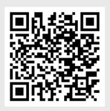

# 🧀🍷 Intermarché Wine & Cheese Pairing Web App

Welcome to the official repository for the **Intermarché Wine & Cheese Pairing Web Application** – a mobile-friendly digital sommelier, built with Bubble for the Intermarché of Saint-Rémy-de-Provence.
This application provides personalized wine and cheese recommendations based on selected recipes, ingredients, or scanned barcodes. Designed for quick in-store use, it requires no installation and works offline after initial load. Targeted primarily at tourists and local customers, the app supports both French and English.

---

## 🚀 How It Works

 **Access**: Shoppers access the app via QR code or direct URL using their smartphones.
 **Home Interface**: Users land on a main page featuring popular wines, cheeses, and recipes.
 **Search or Filter**: They can search for items or filter by type, origin, dietary tags, or price.
 **Product Pages**: Each product page offers details (price, origin, images) and pairing suggestions.
 **Pairing Suggestions**: Selecting a product reveals ideal pairings (e.g., wine for a cheese or recipe).
 **Favorites**: Users can bookmark items for quick reference during shopping.
 **Barcode Scanner**: Scan an Intermarché product to view details and pairings instantly.
 **Languages**: Interface available in both English and French.

Everything is designed to deliver a seamless, engaging, and fast experience that helps customers make better gastronomic decisions in just a few taps.

---

## 🧑‍💻 Technologies

- **No-code Platform**: [Bubble.io](https://bubble.io)
- **External API/Database**: Firebase (for wine/cheese product data)
- **Barcode Plugin**: Bubble barcode scanner
- **Design**: Custom icons, responsive layout, brand-compliant palette

---

## 📍 Instructions

To launch the application, just open it on your smartphone or scan the following QR CODE.
<div align="center">



</div>

To see the further requirements for this project, you can check the [User Manual](./Document/UserManual/userManual.pdf). <br>
Also, you can see the application's flyers by clicking [here](./Document/Flyer/FlyerUS.png).

---

## 📁 Repository Structure

```bash
2024-2025-project-5-bubble-intermarche-team-3/
├── Functional/
├── Technical/
├── QualityAssurance/
├── Management/
├── UserManual/
└── Main/
```

Each directory corresponds to a project role with related documentation and assets.

---

## 👥 Team Members

|              Name               |        Role        |                                       Role Description                                       |                                           LinkedIn & GitHub Links                                           |
| :-----------------------------: | :----------------: | :------------------------------------------------------------------------------------------: | :---------------------------------------------------------------------------------------------------------: |
|         Lena DE GERMAIN         |  Project Manager   | Oversees overall project planning, scheduling, resource allocation, and client communication |       [LinkedIn](https://www.linkedin.com/in/léna-de-germain/) / [GitHub](https://github.com/lenadg18)        |
|          Camille GAYAT          |  Program Manager   | Responsible for functional specifications, requirement gathering, and feature prioritization |   [LinkedIn](https://www.linkedin.com/in/camille-g-a89114293/) / [GitHub](https://github.com/CamilleGayat)    |
|          Julian REINE           |  Technical Leader  |   Provides technical guidance, architecture decisions, and oversees implementation quality   |  [LinkedIn](https://www.linkedin.com/in/julian-reine-b2952632a/) / [GitHub](https://github.com/JulianREINE)   |
|        Guillaume DESPAUX        | Software Developer |                Implements application features using Bubble no-code platform                 |  [LinkedIn](https://www.linkedin.com/in/guillaume-despaux/) / [GitHub](https://github.com/GuillaumeDespaux)   |
| Vivien Bistrel TSANGUE CHOUNGOU | Quality Assurance  |     Designs and executes test cases, ensuring application quality and proper functioning     | [LinkedIn](https://www.linkedin.com/in/bistrel-tsangue-603635261/) / [GitHub](https://github.com/Bistrel2002) |
|          Lucas AUBARD           |  Technical Writer  |          Creates documentation, user guides, and ensures clarity of specifications           |         [LinkedIn](https://www.linkedin.com/in/lucasaubard/) / [GitHub](https://github.com/LucasAub)          |

---

## 📄 Documentation

- 📋 [Functional Specifications](./Document/FunctionalSpecification/functionalSpecification.md)
- 🔧 [Technical Specifications](./Document/TechnicalSpecifications/technicalSpecifications.md)
- 🧪 [Test Plan & QA](./Document/QualityAssurance)
- 📘 [User Manual](./Document/UserManual/userManual.pdf)
- 📚 [Management](./Document/Management)

---

> Made by Team 3 @ Intermarché Project 2025
> This project is registered under the MIT license that you can find [here](./LICENSE.md)
