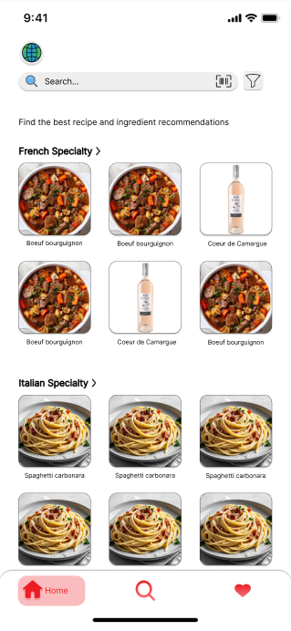
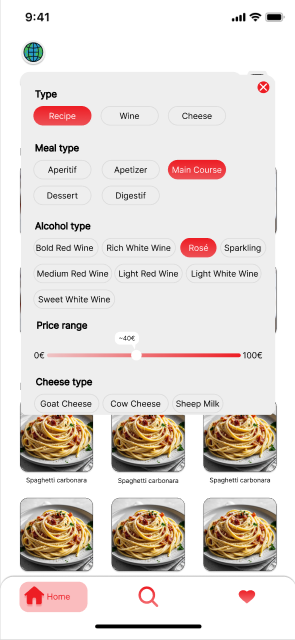
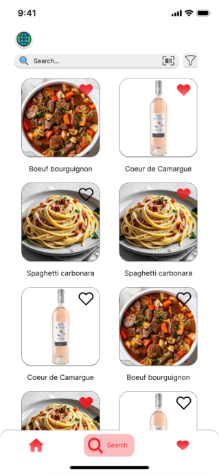
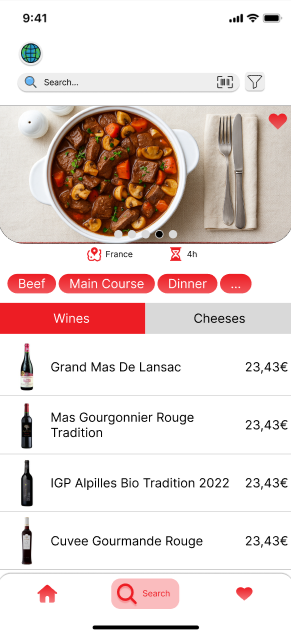
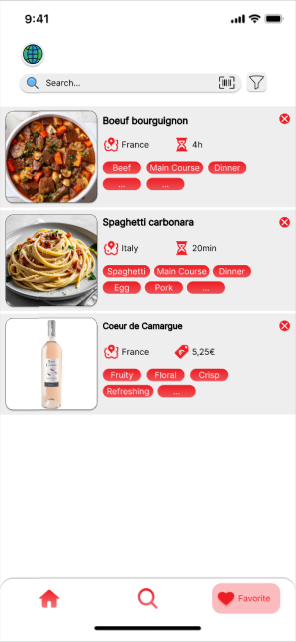
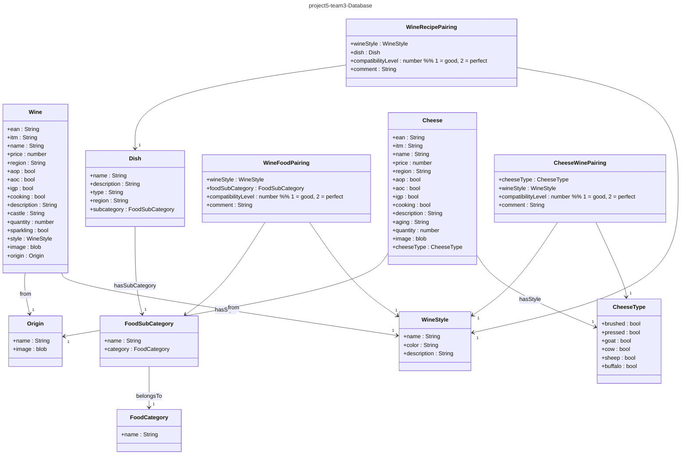

# Technical Specifications - Team 3

---

| Role | Name | Signature | Date |
|---|---|---|---|
| Project Manager | Léna DE GERMAIN | ✅ | //2025 |
| Program Manager | Camille GAYAT | ✅ | //2025 |
| Tech Lead | Julian REINE | ✅ | //2025 |
| Software Developer | Guillaume DESPAUX | ✅ | //2025 |
| Quality Assurance | Vivien Bistrel TSANGUE CHOUNGOU | ✅ | //2025 |
| Technical Writter | Lucas AUBARD | ✅ | //2025 |

## Table of Content

- [Technical Specifications - Team 3](#technical-specifications---team-3)
  - [Table of Content](#table-of-content)
- [I. Project Overview](#i-project-overview)
  - [1. Introduction](#1-introduction)
    - [1.1 Objectives](#11-objectives)
  - [2. Project Scope](#2-project-scope)
    - [2.1 In Scope](#21-in-scope)
    - [2.3 Out Of Scope](#23-out-of-scope)
  - [3. Task Management](#3-task-management)
    - [3.1 Task Distribution](#31-task-distribution)
    - [3.2 Shedule](#32-shedule)
  - [4. Developement Environement](#4-developement-environement)
    - [4.1 Technologies Used](#41-technologies-used)
    - [4.2 Naming Conventions](#42-naming-conventions)
    - [4.3 Github Repository Rules](#43-github-repository-rules)
      - [4.3.1 Github Commits](#431-github-commits)
        - [A. Commit Titles](#a-commit-titles)
        - [B. Commit Body](#b-commit-body)
        - [C. Examples](#c-examples)
      - [4.3.2 Github Comments](#432-github-comments)
    - [4.5 File and folder architecture](#45-file-and-folder-architecture)
- [II. Technical Aspect](#ii-technical-aspect)
  - [1. Application Overview](#1-application-overview)
    - [1.1 Front-End Specifications](#11-front-end-specifications)
      - [A. **Main Page**](#a-main-page)
      - [B. **Filter Page**](#b-filter-page)
      - [C. **Research Page**](#c-research-page)
      - [D. **Product Page**](#d-product-page)
      - [E. **Favorites Page**](#e-favorites-page)
    - [1.2 Backend Overview (Workflow)](#12-backend-overview-workflow)
      - [A. Trigger/Event](#a-triggerevent)
      - [B. Series of Actions](#b-series-of-actions)
      - [C. Conditions](#c-conditions)
  - [2. Database structure](#2-database-structure)
    - [2.1 Database breakdown](#21-database-breakdown)
    - [2.3 Bubble Database breakdown](#23-bubble-database-breakdown)
      - [A. Data Types](#a-data-types)
      - [B. Fields](#b-fields)
      - [C. Things](#c-things)
      - [D. Relationships](#d-relationships)
    - [2.4 API database](#24-api-database)
      - [A. Data Pull](#a-data-pull)
        - [Data Isn’t Stored in Bubble](#data-isnt-stored-in-bubble)
        - [API Connector](#api-connector)
        - [Data Usage](#data-usage)
        - [Data Connexion to Bubble](#data-connexion-to-bubble)
      - [B. Data Push](#b-data-push)
        - [How This Maps in Bubble](#how-this-maps-in-bubble)
  - [3. Bubble building features breakdown](#3-bubble-building-features-breakdown)
    - [A. Visual Editor (Design Tab)](#a-visual-editor-design-tab)
    - [B. Workflow Editor](#b-workflow-editor)
    - [C. Database (Data Tab)](#c-database-data-tab)
    - [D. Plugins](#d-plugins)
    - [E. API Connector](#e-api-connector)
    - [F. Responsive Engine](#f-responsive-engine)
    - [G. Custom States](#g-custom-states)
    - [H. Version Control \& Deployment](#h-version-control--deployment)
    - [I. SEO and Hosting](#i-seo-and-hosting)
  - [4. Features usage](#4-features-usage)
- [III. Development Process](#iii-development-process)
  - [1. Developement rules](#1-developement-rules)
  - [2. Risks and Mitigation Strategies](#2-risks-and-mitigation-strategies)
  - [3. Testing](#3-testing)
    - [3.1 Testing Strategy](#31-testing-strategy)
    - [3.2 Scalability and Performance](#32-scalability-and-performance)
  - [4. Future Improvements](#4-future-improvements)
  - [5. Glossary of Key Terms](#5-glossary-of-key-terms)

---

# I. Project Overview

## 1. Introduction

Welcome to the **fifth** project of this year, the project **bubble intermarché**.
This project is **a commission** from [Intermarché](https://www.intermarche.com/accueil), a french grocerie store brand, especially the intermarché from *Saint-Remy-de-Provence*.

The purpose of this project is to develop a **working web interface** using the no-code engine **bubble** showing the possible combination between wines and cheeses.The target users include:

- Tourist and users who want to learn more about the french gastronomic culture.

### 1.1 Objectives

Saint-Rémy-de-Provence is a highly **touristic** area in France. The local Intermarché supermarket asked us to develop a **functional web interface** that could **showcase possible wine and cheese pairings**, based on both their current stock and traditional French gastronomy. The goal was to make these pairings more accessible to people around the world, with a special focus on the many tourists visiting the region.
The application will be able to **associate**, using a **custom database**, the different **wine and cheese combinations** with aswell, **dishes recommendations** (e.g Boeuf bourguignion for the Red wine).
The team will focus on creating an **user intuitive interface** so everybody, even tourrist who are not trained in computer science, can understand it fully and use it in its proper way.

---

## 2. Project Scope

Bubble will help us creating an user intuitive application, but we need to keep in mind the scope of the project to assure a good workflow:

### 2.1 In Scope

- Wine / Cheese recommandation
- User Friendly interface
- Complete filter of wine and cheese for the web app
- Scanning function to identify the product

### 2.3 Out Of Scope

- Geolocalisation of the products in the store's shelfs
- shipping or delivery services
- Creating new Wine / Cheese pairings
- Advanced settings functions

The project will be developped using the no-code engine Bubble.

---

## 3. Task Management

The project will be divided into the following tasks:

- User Interface: Creating an intuitive and interactive user interface for the wine and cheese pairing service.
- Bar code scanning: Creating the Bar Code scanning feature.
- Testing and Debugging: Testing the system for bugs, performance issues, and usability problems, and fixing them as soon as possible.
- Data base creation / Implementation: Creating the wine and the cheese databases based on the provided documentation.
- Documentation: Writing technical documentation, user guides, and other relevant documentation for the project.

The team will collaborate across all project tasks, with each member bringing their specific skills and expertise to different parts of the work. Regular meetings will be scheduled to review progress, share updates, and quickly resolve any challenges that may appear during development. Throughout the process, the team will also engage with the customer to gather feedback and confirm that deliverables meet expectations.

The project aims to be completed within the agreed timeline, with consistent updates provided to the customer to ensure the work stays aligned with their needs and requirements.

### 3.1 Task Distribution

The tasks will be distributed among the team members:

- User Interface: Guillaume (SE)
- Data base creation / Implementation: Guillaume (SE) / Julian (TL)
- Bar code scanning: Guillaume (SE)
- Testing and Debugging: Vivien (QA), Guillaume (SE)
- Documentation: Vivien (QA), Julian (TL), Camille (PGM), Lucas (TW), Guillaume (SE)

### 3.2 Shedule

The project will be divided in 6 weeks, with the following milestones:

- Week 1: Overview of the project, creation of the roadmap.
- Week 2: Mockup creation, starting the functional specification.
- Week 3: Functional specification completion, starting the technical specification. Code should be in progress based on the mockup.
- Week 4: Technical Specification completion, starting the usermanual.
- Week 5: Code should be almost done, Quality Assurance testing is starting.
- Week 6: Oral presentation preparation.

---

## 4. Developement Environement

Our team uses multiple machines to work on this project, such as:

- 2 Windows operating on Windows 11.
- 4 MacBooks operating on MacOS 15 Sequoia

### 4.1 Technologies Used

During this project, we will use:

- [Bubble](https://bubble.io/home/): Bubble is a website making tool and a PaaS developed by Bubble Group. It can be used by people with limited or no programming experience to make web pages.

- Bubble pluggins:
  - Barcode Scanner: A barcode scanner that will allow you to scan from any camera on your device! You can choose the camera from a list enumerated from your device and use that to scan barcodes, or alternatively choose 'Front' or 'Back' and allow the plugin to find the correct camera.
  - CSS loading animations: Loading.io's CSS spinner uses CSS Animation to create Loading and Preloading animations. There are supported by all modern browsers such as Google Chrome and Mozilla Firefox.
  - Local Storage & Cookies: Create cookies on the Device Local Storage to store information in a persistent way.
  - API connector: The API connector lets you define your own API calls directly in the Bubble Editor and use them in your app.

### 4.2 Naming Conventions

The team will use **PascalCase** for both documentation and **code structure.**

PascalCase offers **clarity and precision**, making it easy for users to quickly identify and distinguish the individual words in a document or file name. Words are joined without spaces, with each new word starting with a capital letter.
**Example of PascalCase:**

``` TechnicalSpecification.md ```

### 4.3 Github Repository Rules

To maintain the **quality** of documents in both the main branch and release versions, we have **established** a set of rules.

The main branch is protected and only allows changes through pull requests. This ensures the branch remains free from unintended modifications. Each pull request must be approved by at least two team members.

The only exception to these rules is the "Documents" branch, as it does not contain source code.

#### 4.3.1 Github Commits

Commits must adhere to specific guidelines, most of which are outlined in this document [here](https://github.com/FlowingCode/DevelopmentConventions/blob/main/conventional-commits.md).

##### A. Commit Titles

The title is a crucial part of any commit. It provides a concise summary of the changes, indicating what has been implemented, fixed, or removed. As such, it must comply with the following rules:

- **Clarity:** The title should accurately reflect the content of the commit.
- **Naming Convention:** It must follow the project's naming standard—PascalCase, in our case.
- **Professionalism:** Even if the commit is made in the "Documents" branch, the title should be free of grammar mistakes and written in clear, understandable language.

> [!NOTE]
> Additionally, titles should not exceed 50 characters. They must describe the action taken (using a verb) and include the name of the feature or file affected.

##### B. Commit Body

The body of a commit provides a more detailed explanation of the changes and, like the title, must follow specific guidelines:

- **Provide context:** Clearly explain why the change was necessary.
- **Summarize the changes:** Briefly describe how the changes were implemented, especially in cases of new features, fixes, refactoring, or optimizations.
- **Reference related issues:** Link to relevant issue numbers when applicable.
- **Keep it concise:** Avoid long paragraphs; use bullet points or short lines to list what was done.
- **Use clear language:** Avoid technical jargon unless it's explained—other contributors should be able to understand your commit easily.

> [!NOTE]
> The body can also contain specific keywords that can interact with the repository, such as adding co-authors, closing issues, etc. They can be found [there](https://github.com/FlowingCode/DevelopmentConventions/blob/main/conventional-commits.md/#5-Footer) in the footer section.

##### C. Examples

This is an template for a correct commit:

```plaintext

[Type of change] (Quick Summary) --> Title

[What you implemented] --> Body
- [Implementations].
- [Update].

```

#### 4.3.2 Github Comments

We follow github standards to enhance readability, but without comments, understanding the commits can take longer than necessary.

To ensure that other team members can **collaborate effectively** and to support long-term maintenance, comments are essential.
Team members have to **follow the same rules** said before for the comment section to ensure the workflow stays understandable.

### 4.5 File and folder architecture

```bash
 2024-2025-project-5-bubble-intermarche-team-3
├── Documents   
│   │ 
│   ├── Functional
│   │       ├── Images
│   │       └── FunctionalSpecifications.md
│   │  
│   ├── Management
│   │       ├── Images   
│   │       ├── ManagementArtifacts
│   │       └── WeeklyReports
│   │                     
│   ├── QualityAssurance
│   │       ├── Images    
│   │       ├── TestCase.md  
│   │       └── testPlan.md   
│   │              
│   ├── Technical                                
│   │       ├── Images
│   │       ├── TechnicalSpecification.md
│   │       └── convention.md
│   │            
│   └── dev                                
│           ├── 
│           ├── 
│           └── 
│
├── .gitignore
└── README.md

```

---

# II. Technical Aspect

This is the **section where the technical aspect of the project** will be explained in detail. We will dive into all of the features of the project, how they work and more specifications on them.

> [!Note]
> As we are using Bubble, there is not real Back-End developement. Bubble's functions for developing will be explained, but i will not be able to provide to you futher informations on how every modules works.

---

## 1. Application Overview

### 1.1 Front-End Specifications

Based on the mockups approved by the client, the front end will include the following pages:

#### A. **Main Page**

The main page allows users to view and interact with highlighted products.

- **Header:** Contains the navigation bar, barcode scanner, filter button, and language switcher.
- **Footer:** Includes navigation buttons for accessing different pages.
- **Page Content:** Displays the user’s selected products. Clicking a product redirects the user to the Research Page.

<p align="center">
  
</p>

---

#### B. **Filter Page**

This page lets users filter products based on specific criteria.

- **Header:** Expanded to include filter options. Users can search by product type (cheese or wine) or look for specific combinations.
- **Footer:** Same as the main page.
- **Page Content:** Similar layout to the main page, with added filters in the header. After selecting their filters, users are redirected to the Research Page.

<p align="center">
  
</p>

---

#### C. **Research Page**

The Research Page enables users to browse products based on their search or filter.

- **Header:** Remains unchanged.
- **Footer:** Remains unchanged.
- **Page Content:** Displays a list of matching products, including images. Clicking on a product takes the user to the Product Page.

<p align="center">
  
</p>

---

#### D. **Product Page**

This page shows detailed information about a selected product.

- **Header:** Remains unchanged.
- **Footer:** Remains unchanged.
- **Page Content:** Displays several product images, attribute tags, pricing information, recommended pairings (e.g., wine with cheese), and potential recipes using the product.

<p align="center">
  
</p>

---

#### E. **Favorites Page**

The Favorites Page allows users to manage their saved products.

- **Header:** Remains unchanged.
- **Footer:** Remains unchanged.
- **Page Content:** Lists all favorited products with their name, tags, and image. Users can remove items from their favorites or click on a product to view its detailed Product Page.

<p align="center">
  
</p>

### 1.2 Backend Overview (Workflow)

Bubble's workflow is the brain behind the intuitive user interface. You can see it as the backend of the project. Bubble workflow is mainely composed of:

#### A. Trigger/Event

The trigger event is a block that starts the workflow, such as:

- A button click
- A page load
- A user logging in
- A custom event
- An API workflow

#### B. Series of Actions

These are executed sequentially, for example:

- Create a new thing (add to Bubble’s DB)
- Make an API call (to Firebase, for example)
- Show an element or “Navigate to another page”

#### C. Conditions

Each action can run only when certain conditions are met, e.g.:

- Only if Input's value is not empty
- Only if Current User's role is admin
  
---

## 2. Database structure

Bubble provides a simple and efficient way to manage databases. Through the "Data" section of the platform, users can easily **add**, **modify**, and **retrieve** information from the database with minimal effort.

This section also allows you to view how the database is structured, including how various data types are interconnected and related to each other.



---

### 2.1 Database breakdown

In this database structure, each product is described with detailed specifications. For instance, when a wine is selected, all of its associated attributes will be displayed on the app's "Product Page."

The database is **read-only for users**—only the client will have permission to modify its content. All data will be entered **manually** by the client.

The data model is organized using **main classes**, with relationships established through **subclasses**. Both wines and cheeses have their own dedicated classes, allowing for clear identification and classification based on specific criteria.

Below is an example of how wine entries are structured in the database.

``` plaintext

%% ======= WINE DOMAIN ========

class Wine {
    +ean : String
    +itm : String
    +name : String
    +price : number
    +region : String
    +aop : bool
    +aoc : bool
    +igp : bool
    +cooking : bool
    +description : String
    +castle : String
    +quantity : number
    +sparkling : bool
    +style : WineStyle
    +image : blob
    +origin : Origin
}

```

| Statement   | Explaination |
|---------|----------------|
| Bool    | True / False Statement |
| String  | Text input statement  |
| Number  | Number input statement  |

This is the core class for all wine-related items.

**Identification:** ean, itm, name

**Commercial info:** price, quantity, castle, description, image

**Legal labels:** aop, aoc, igp (French certifications)

**Categorization:** style (linked to WineStyle), origin (linked to Origins)

**Usability:** cooking, sparkling flags

**WineStyle**: Represents the stylistic characteristics of a wine:

**name:** e.g., "Fruity Red", "Dry White"

**color:** e.g., red, white, rosé

**description:** extra info for pairing

**Origin**: Describes the wine’s geographic origin and image, used in both Wine and Cheese classes. This adds reusability and consistency.

The subcatergories are connected together to thoses two categories allowing the user to find the best wine / cheese combination when checking one of the criterias givens.

---

### 2.3 Bubble Database breakdown

Bubble uses a built-in, no-code database that stores data in "Data Types", which are like tables in a **traditional** database. Each "Data Type" has Fields, which are like **columns**, and each Entry is a **row or object**.

#### A. Data Types

- These are the main entities in your app.

```Example: User, Wine, Cheese, Pairing```

#### B. Fields

Each Data Type has fields — think of them as properties or attributes.

Types: text, number, date, yes/no, file, image, geographic address, another Data Type (for relationships), list of things

```Example: Wine might have a field Type = red (text), Acidity Level = 4 (number)```

#### C. Things

- A "Thing" is a single entry in a Data Type — like a single wine.

#### D. Relationships

- Fields can reference other Data Types.

```Example: A Pairing can have a field Wine (type = Wine) and Cheese (type = Cheese)```

You can also have lists: e.g., User → SavedPairings (list of Pairings)

---

### 2.4 API database

Because Bubble database's **is limited**, we decided to use an API to upload our database and **bypass this limit**. We decided to use [FireBase](https://firebase.google.com/) to create our own API dataset.

#### A. Data Pull

##### Data Isn’t Stored in Bubble

**You're not creating Bubble database entries** (like internal records). Instead, you’re pulling data from Firebase, showing it in the app, or sending data back to Firebase.

It’s a live connection so every time you show or update something, it makes an API call (unless you manually store it in Bubble’s database).

##### API Connector

The API Connector lets you define requests to external APIs (like the Firebase’s API we created):

- **GET** requests fetch data from Firebase.

- **POST/PATCH/DELETE** requests write or modify data in Firebase.

##### Data Usage

Works in One-Way Unless You Store It. Bubble can display theses external data directly, but:

- You **can’t use** native filtering/searching on external data like you can using bubble's database.

- You **can’t use** built-in privacy rules like the one used by bubble. (**Firebase handles its own security**).

You’ll often want to **transform or cache** this data locally for performance or UI needs.

##### Data Connexion to Bubble

With Firebase, data is protected via Firebase **security rules**. This is separate from Bubble’s privacy system.
You must handle:

- **Auth tokens** (e.g., OAuth2 or Firebase custom tokens).

- **API key permissions**.

#### B. Data Push

In Firebase (specifically Cloud Firestore), you can **modify / add** elements to the database by:

- Creating a new document in a collection or updating an existing document.
This is done by making a **POST or PATCH HTTP** request to Firebase’s REST endpoint, depending on whether you're creating or updating.
  
##### How This Maps in Bubble

You can set, using the **API Connector pluggin**, the api connexion between **bubble and firebase**. The API is integrated following theses paterns:

Method: ```GET```

URL: ```https://firestore.googleapis.com/v1/projects/YOUR_PROJECT_ID/databases```

Headers:

- Authorization: ```your_token```

- Content-Type:  ```application/json```

Body: ```Raw JSON```

> [Note]
> You can insert dynamic values using dynamic placeholders.

---

## 3. Bubble building features breakdown

### A. Visual Editor (Design Tab)

- Drag-and-drop UI builder for creating responsive layouts.
- Pre-built elements: text, buttons, inputs, repeating groups, icons, images, etc.
- Custom styling via Bubble's style manager.

### B. Workflow Editor

- Logic engine to handle actions and events (e.g., when a button is clicked, sign up a user, navigate, show a message).
- Conditions and triggers (e.g., "Only when...").

### C. Database (Data Tab)

- Built-in database for creating and managing custom data types (like tables) and fields.
- Includes a dev and live database, and supports privacy rules.

### D. Plugins

- Extend functionality with third-party or Bubble-made plugins (e.g., API connector, Style animations etc...).

> [!Note]
> You can also create your own plugins if needed.

### E. API Connector

- Lets you connect to external APIs (RESTful APIs) without code.
- Define API calls and use them in workflows or data sources.

### F. Responsive Engine

- Helps design layouts that adapt to different screen sizes.
- Use conditionals and breakpoints to tweak mobile/tablet/desktop experiences.

### G. Custom States

- Store temporary data on the front end (like UI state) without writing to the database.

### H. Version Control & Deployment

- Built-in version control, including autosave and deployment from dev to live.
- Ability to create “development versions” for testing.
- Security & Privacy Rules
- Fine-grained privacy controls for data access.
- Set rules per data type for who can view/edit/delete entries.

### I. SEO and Hosting

- Built-in hosting, with options to add meta tags, custom domains, and SSL.
- Support for SEO-friendly URLs and content.

---

## 4. Features usage

During this project, the team will be using bubble's elements to create the application. Bubble features building blocks that are intuitive to use. Our software engineer will use these building groups and will create the web app based on this. But for the app to work correctly it needs a "backend" logic named the workflow.

---

# III. Development Process

## 1. Developement rules

To maintain quality and consistency, the following rules will be followed:

- **Test Before Implementing:** Features are first tested in isolated Bubble environments. Only once verified will they be merged into the main project.
- **No-Code Review:** All changes are peer-reviewed within Bubble to ensure adherence to best practices and project standards.
- **Cross-Platform Testing:** The app will be tested across various devices and browsers to ensure accessibility and responsiveness.
- **Performance Optimization:** The team will ensure fast load times and a smooth user experience across all platforms.
  
---

## 2. Risks and Mitigation Strategies

During development, the project may encounter a range of risks, including technical limitations, resource constraints, and scheduling issues. To address these proactively, the team has outlined the following mitigation strategies:

1. **Technical Limitations**: Challenges related to Bubble’s no-code capabilities or integration restrictions may arise. To mitigate this, the team will perform in-depth research, utilize online documentation and forums, and consult experts when necessary to find workarounds and solutions.
2. **Resource Availability**: Limited access to certain Bubble features or external dependencies could hinder development. The team will manage this risk by collaborating closely with stakeholders, prioritizing essential features, and seeking external support or workarounds when needed.
3. **Timeline Delays**: Unexpected setbacks such as technical hurdles, evolving requirements, or limited team availability may delay progress. To reduce this risk, the team will maintain clear communication, monitor project milestones, and revise schedules as necessary to stay aligned with delivery goals.

By identifying these potential risks early and planning responsive mitigation strategies, the team aims to reduce disruptions and ensure the project stays on track for a successful and timely completion.

---

## 3. Testing

The testing part of the project will be done using the following tools:

- **Manual Testing**: For exploratory testing, usability testing, and edge case scenarios that may not be covered by automated tests.

### 3.1 Testing Strategy

The testing strategy is built around key development principles to ensure the application's quality and stability throughout its lifecycle:

- **Test Early, Test Frequently**: Testing is integrated from the beginning of the development process. Unit tests will be written as components and functions are implemented.
- **Leverage Automation**: Automated testing will be employed to validate critical features, minimize manual testing efforts, and maintain consistent coverage.
- **Maximize Coverage**: The goal is to achieve high test coverage by focusing on core functionalities, edge cases, and potential error scenarios to ensure system resilience.
- **Regression Prevention**: Regular regression testing will be conducted to ensure new updates do not break or degrade existing features.
- **User-Focused Validation**: Usability, accessibility, and direct user feedback will be part of the testing workflow, ensuring a smooth and inclusive experience.

---

### 3.2 Scalability and Performance

The system will be engineered for scalability and performance, enabling it to handle complex operations, high data volumes, and significant user traffic. Key practices include:

- **Efficient No-Code Development**: Write clear and optimized no-code logic to reduce load and improve responsiveness.
- **Data Caching**: Use caching strategies within Bubble to reduce repetitive computations and speed up data access.
- **Lazy Loading**: Load only the components and data needed at runtime, improving load times and user responsiveness.
- **Robust Error Handling**: Gracefully manage unexpected errors, preventing application crashes and providing users with informative feedback.
- **Performance Monitoring**: Utilize monitoring tools and analytics to measure performance, detect bottlenecks, and continuously improve.
- **Load Testing**: Simulate high traffic conditions to assess how the system behaves under pressure and identify scalability limitations.

By following these practices, the application will be built to scale, perform efficiently, and provide a seamless user experience.

---

## 4. Future Improvements

Below is a list of potential enhancements that could be considered for future development:

- **Upgrading to a better plan in bubble:** We are currently running on the free version of bubble to present to you our application but bubble offers various paids plan including usefull features that remove the limitations we had during this project.
- **Generalisation of the project:** Making it possible to link more Intermarché stores to enhance the french culture in other touristic region of france.
- **Real time stock count:** We could implement, using a realtime database of the product availiability, create a tracker system to warn the user if the product they want is unavailiable in the store he want to go.
- **Personalized Recommendations:** Learn from user behavior: saved pairings, ratings, dislikes. Offering tailored suggestions based on past activity or taste profiles
- **Online shopping systeme:** being able to buy the desired product directly from the application.

---

## 5. Glossary of Key Terms

| Term | Explanation |
|------|-------------|
| **Bubble** | A no-code web development platform used to create web applications without traditional programming. |
| **API Connector** | A plugin in Bubble used to define and manage external API calls from within the no-code editor. |
| **API (Application Programming Interface)** | A way for applications to communicate and exchange data; used here to connect Bubble with Firebase. |
| **Firebase** | A backend-as-a-service platform by Google, used in this project to host the external database. |
| **No-code** | Development using visual interfaces instead of writing source code; Bubble is a no-code tool. |
| **Data Type** | A structured entity (like a database table) in Bubble used to define objects such as Wine or Cheese. |
| **Field** | A property of a data type, like "price" or "region" in a Wine entry. Comparable to columns in a spreadsheet. |
| **Thing** | A single entry or record in a Bubble data type (e.g., one specific wine). |
| **Workflow** | A series of actions in Bubble triggered by an event (like clicking a button), similar to backend logic. |
| **Trigger/Event** | The action that starts a workflow (e.g., page load, button click). |
| **Condition** | A rule that determines whether a workflow action should be executed (e.g., only if user is logged in). |
| **Custom State** | Temporary front-end memory in Bubble used to store UI information without saving to the database. |
| **EAN / ITM** | EAN (European Article Number) and ITM (internal identifier) are used to uniquely identify products. |
| **Responsive Engine** | Bubble’s tool to ensure the app layout adapts to different screen sizes (mobile/tablet/desktop). |
| **Version Control** | System for managing and tracking changes in development; Bubble supports this natively. |
| **Privacy Rules** | Permissions in Bubble that control who can view or modify data. |
| **Lazy Loading** | Technique to delay loading of content until it's needed, improving performance. |
| **Data Caching** | Temporarily storing data for faster access and better performance. |
| **Repeating Group** | A UI element in Bubble used to display a list of things dynamically (e.g., a list of wines). |

---
