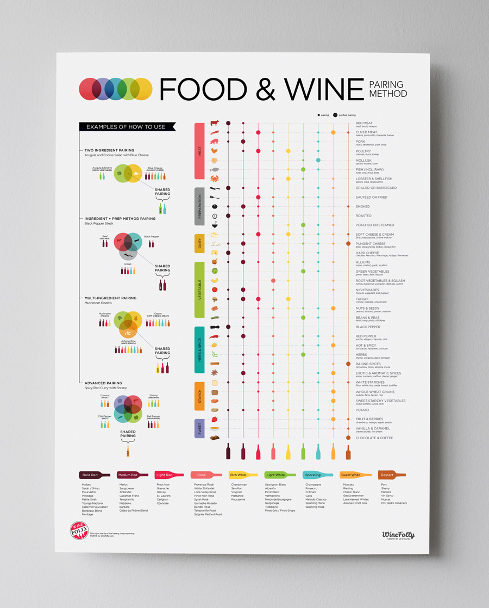
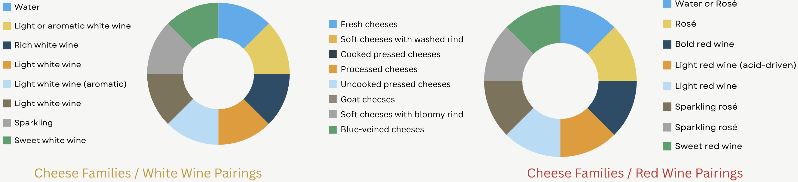
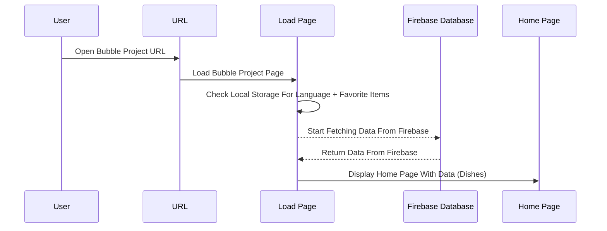
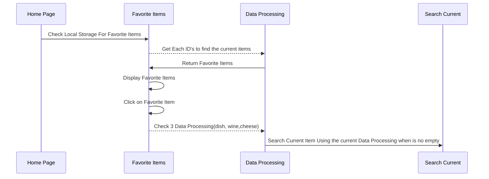
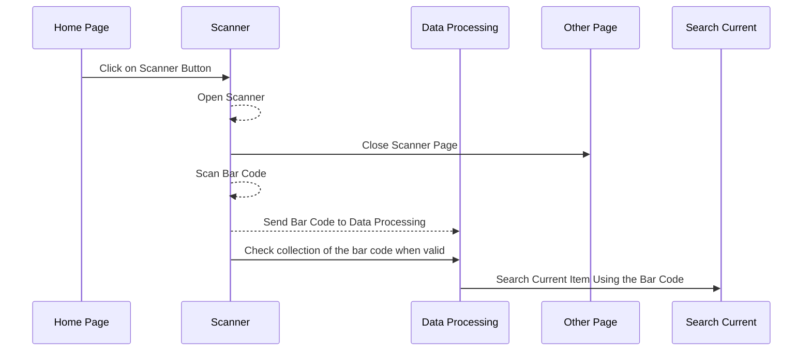
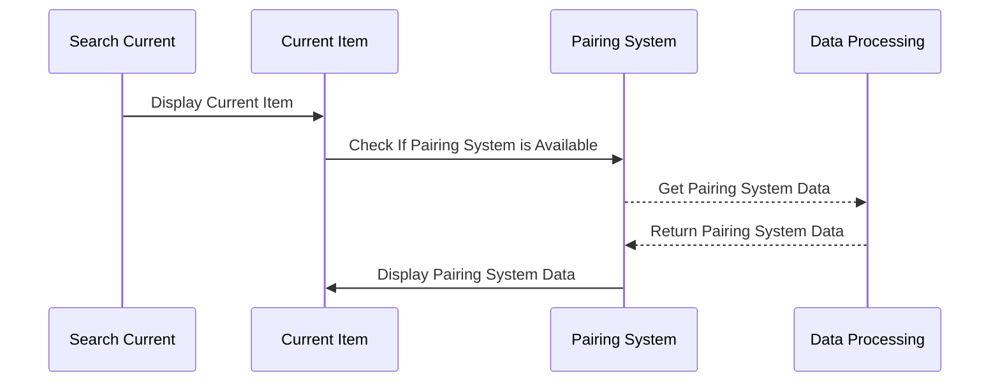
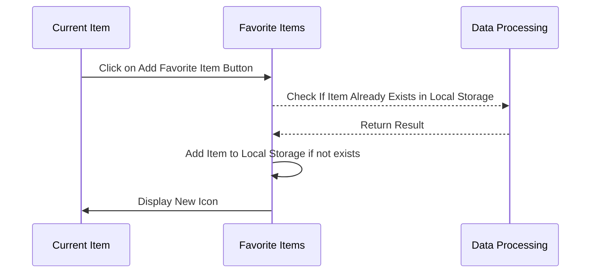
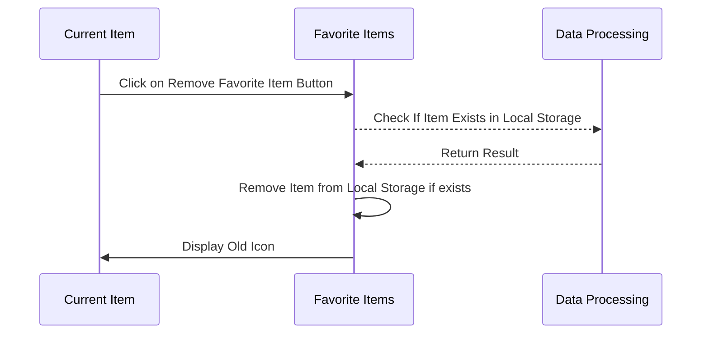
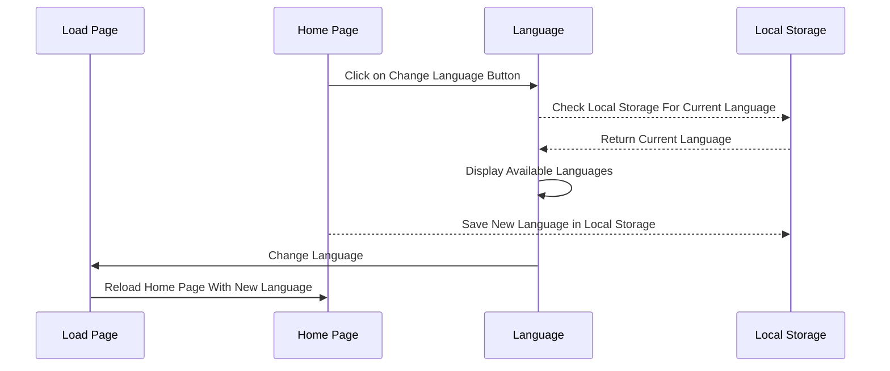
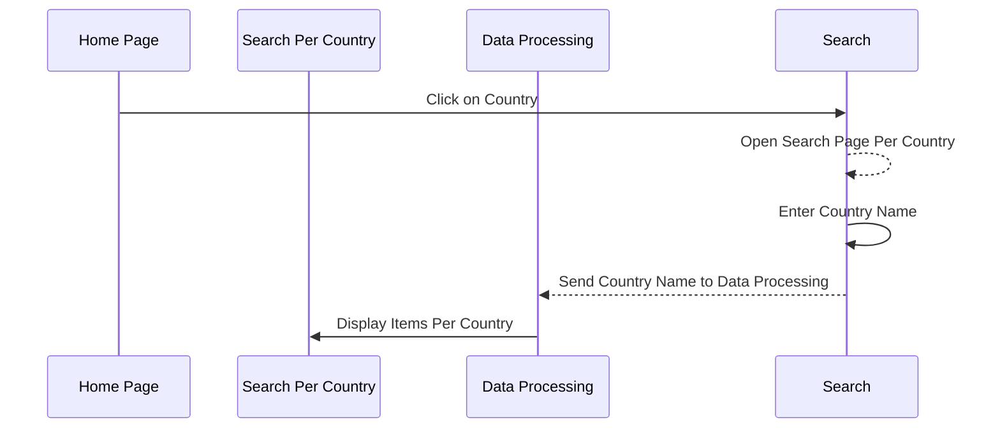

# Road Map Of The Bubble Project

## Document Information

- **Author**: [Guillaume Despaux](https://github.com/guillaumedespaux)
- Last Updated: 06/16/2024
- **Version**: 1.0
- Website: [Bubble Project](https://project5-team3.bubbleapps.io/version-test)
- Website Debug: [Bubble Project Debug Mode](https://project5-team3.bubbleapps.io/version-test?debug_mode=true)
  
## Table of Contents

- [Road Map Of The Bubble Project](#road-map-of-the-bubble-project)
  - [Document Information](#document-information)
  - [Table of Contents](#table-of-contents)
  - [Project Overview](#project-overview)
  - [Key Components](#key-components)
  - [Pairing Systems](#pairing-systems)
    - [Meal Type / Wines Pairing](#meal-type--wines-pairing)
    - [Cheese / Wines Pairing](#cheese--wines-pairing)
  - [Bubble Project Overview](#bubble-project-overview)
    - [User Connection](#user-connection)
    - [Check Favorite Items \& Display Them](#check-favorite-items--display-them)
    - [ScannerPage](#scannerpage)
    - [Current Item Page + Pairing System](#current-item-page--pairing-system)
    - [Add Favorite Item](#add-favorite-item)
    - [Remove Favorite Item](#remove-favorite-item)
    - [Change Language](#change-language)
    - [Search Per Country](#search-per-country)
  - [States Management](#states-management)
    - [Home Page](#home-page)
    - [Search Page](#search-page)
      - [Group SeachForSingleElement](#group-seachforsingleelement)
      - [Group SeachForList Of Dishes (Country)](#group-seachforlist-of-dishes-country)
      - [Group SeachForList From SeachBar + Filters](#group-seachforlist-from-seachbar--filters)
    - [Favorite Page](#favorite-page)
    - [Scanner Page](#scanner-page)
  - [Workflow](#workflow)
    - [CHEESE DATA FETCH + SORT](#cheese-data-fetch--sort)
    - [DEBUG](#debug)
    - [DELETE DATA](#delete-data)
    - [DISH DATA FETCH + SORT](#dish-data-fetch--sort)
    - [Favorite From Fav](#favorite-from-fav)
    - [Favorite From Search Filtered](#favorite-from-search-filtered)
    - [Favorites From Search](#favorites-from-search)
    - [FilterMenu](#filtermenu)
    - [FilterOptions](#filteroptions)
    - [Indexes](#indexes)
    - [Languages](#languages)
    - [Loading](#loading)
    - [Scanner](#scanner)
    - [Search From Favorite](#search-from-favorite)
    - [Search Indexes](#search-indexes)
    - [Searching by Clicking Items](#searching-by-clicking-items)
    - [Searching From Seach Filtered](#searching-from-seach-filtered)
    - [Searching using the headerNavigation](#searching-using-the-headernavigation)
    - [WINE DATA FETCH + SORT](#wine-data-fetch--sort)

## Project Overview

This document will provide a high-level overview of the logic and structure of the Bubble project highlighting the key components, their interactions, and the states.

## Key Components

- **Single Page Use**: This Bubble project is designed to be a single-page to prevent low Internet connection and/or no Internet connection from the final user.
- **Firebase Database**: Since the Bubble project in fremium version is limited to 200 "Things" in the database the need to use Firebase as a database is required to outpass this limitation.
- **Bar Code Scanner**: To help the user to find products the Bubble project will use a bar code scanner.
- **Local Storage**: To store information locally since the Bubble doesn't plan to use account to retrieve data we will use the local storage of the browser to store data:
  - **Language**: The language that the user has selected.
  - **Favorite Items**: the items that the user has selected as favorite.
- **Paring System (Cheese & Wine)**: The project will include a pairing system to suggest cheese and wine combinations based on meal types or specific cheese/wine selections.

## Pairing Systems

### Meal Type / Wines Pairing

>[!NOTE]
> The pairing system will be based on the image above.
---
>[!IMPORTANT]
> Each dots corresponds to a score between type of meal and wine:
>
> - No Dot: 0
> - Small Dot: 1
> - Big Dot: 2

### Cheese / Wines Pairing

>[!NOTE]
> The pairing system will be based on the image above.
---
>[!IMPORTANT]
> Each corelation corresponds to a fixed score of 1 between cheese and wine.

## Bubble Project Overview

### User Connection

### Check Favorite Items & Display Them

### ScannerPage

### Current Item Page + Pairing System

### Add Favorite Item

### Remove Favorite Item

### Change Language

### Search Per Country

## States Management

Since this Bubble project is a single-page application all the name mentioned after are components that are used to create the visual part and store the states of the application.

---

### Home Page

- **index**:
  - currentCollection: text to keep track the current collection of items
  - currentSearch: text to keep track of the current ID of the item
  - currentLanguage: text to keep track of the current language (Default is English)
  - scanner: boolean to keep track if the scanner is open or not

- **Filters Options**:
  - maxPrice: number to keep track of the maximum price of the item (default is 100)
  - minPrice: number to keep track of the minimum price of the item (default is 1)
  - Type: list of texts to keep track of the types of research for the filter

- **ListOfLanguages**:
  - isOpen: boolean to keep track if the list of languages is open or not (default is no)

- **NavigationButtons**:
  - index: text to keep track of the current index of the navigation buttons (default is loading)

---

### Search Page

#### Group SeachForSingleElement

- **SearchPage**:
  - searchBar: boolean to keep track if the research have been done through the search bar or not (default is no)

- **FirestoreDataProcessor wine**:
  - bold_redName: text to keep track of the bold red wine ID
  - bold_redValue: number to keep track of the current bold red wine value for pairing
  - medium_redName: text to keep track of the bold white wine ID
  - medium_redValue: number to keep track of the current medium red wine value for pairing
  - light_redName: text to keep track of the light red wine ID
  - light_redValue: number to keep track of the current light red wine value for pairing
  - rich_whiteName: text to keep track of the rich white wine ID
  - rich_whiteValue: number to keep track of the current rich white wine value for pairing
  - dessertName: text to keep track of the dessert wine ID
  - dessertValue: number to keep track of the current dessert wine value for pairing
  - light_whiteName: text to keep track of the light white wine ID
  - light_whiteValue: number to keep track of the current light white wine value for pairing
  - sparklingName: text to keep track of the sparkling wine ID
  - sparklingValue: number to keep track of the current sparkling wine value for pairing
  - sweet_whiteName: text to keep track of the sweet wine ID
  - sweet_whiteValue: number to keep track of the current sweet wine value for pairing
  - sortingList: list of texts to keep track of the sorting list of wines using map:json format.

- **FirestoreDataProcessor cheese**:
  - blueVeinedName: text to keep track of the blue-veined cheese ID
  - blueVeinedValue: number to keep track of the current blue-veined cheese value for pairing
  - cookedPressedName: text to keep track of the cooked pressed cheese ID
  - cookedPressedValue: number to keep track of the current cooked pressed cheese value for pairing
  - freshName: text to keep track of the fresh cheese ID
  - freshValue: number to keep track of the current fresh cheese value for pairing
  - goatName: text to keep track of the goat cheese ID
  - goatValue: number to keep track of the current goat cheese value for pairing
  - uncookedPressedName: text to keep track of the uncooked pressed cheese ID
  - uncookedPressedValue: number to keep track of the current uncooked pressed cheese value for pairing
  - processedName: text to keep track of the processed cheese ID
  - processedValue: number to keep track of the current processed cheese value for pairing
  - softBloomyName: text to keep track of the soft bloomy cheese ID
  - softBloomyValue: number to keep track of the current soft bloomy cheese value for pairing
  - softWashedName: text to keep track of the soft washed cheese ID
  - softWashedValue: number to keep track of the current soft washed cheese value for pairing
  - sortingList: list of texts to keep track of the sorting list of cheeses using map:json format.
  - bestChoice: First item of the sorting list split by(,):last item of sortingList.

- **FirestoreDataProcessor dish**:
  - sortingList: list of texts to keep track of the sorting list of dishes using map:json format.

- **Group Image+Infos Dish**:
  - currentFoodSubCatCount: number to keep track of the current food sub-category count in the dish
  - currentPairingCount: number to keep track of the current pairing count in the dish

>[!NOTE]
> This count down is used for each iteration to count the right amount of wineStyle matching with the dish.

#### Group SeachForList Of Dishes (Country)

- **Group SeachForList Of Dishes (Country)**:
  - currentCountry: text to keep track of the current country selected

#### Group SeachForList From SeachBar + Filters

- **Group SeachForList From SeachBar + Filters**:
  - currentSearch: text to keep track of the current search in the search bar

---

### Favorite Page

- **Group ContentPage**:
  - favoriteList: list of texts to keep track of the favorite items in the local storage

---

### Scanner Page

- **Group DetectedItem**:
  - scannerResult: text to keep track of the scanned item result

## Workflow

This section will provide an overview of the workflow of the Bubble project to show how the each components interacts with each other and how the data is handled.

### CHEESE DATA FETCH + SORT

1. When the FirebaseDataExtractor is used to fetch the cheese data, it will retrieve the data from the Firebase database.
2. The data will be sorted using the sortingList from the FirestoreDataProcessor cheese.
3. The sorted data will be displayed in the SearchPage under the Group SeachForSingleElement component.

### DEBUG

1. Refresh each FirebaseDataList when the page is loaded and the data :count is equal to 0.

### DELETE DATA

1. When a new current item is selected, the previous states stored in the SearchPage will be deleted.
2. The SearchPage will reset the states to their default values.
3. The SearchPage will then fetch the new data from the Firebase database and display it in the SearchPage under the Group SeachForSingleElement component.

### DISH DATA FETCH + SORT

1. When the FirebaseDataExtractor is used to fetch the dish data, it will retrieve the data from the Firebase database.
2. The data will be sorted using the sortingList from the FirestoreDataProcessor dish.
3. The sorted data will be displayed in the SearchPage under the Group SeachForSingleElement component.

### Favorite From Fav

1. When the user clicks on the favorite button in the CurrentItem, it will check if the item is already in the local storage.
2. If the item is not in the local storage, it will add the item to the local storage and display the new icon.
3. If the item is already in the local storage, it will remove the item from the local storage and display the old icon.

### Favorite From Search Filtered

1. When the user clicks on the favorite button in the SearchPage, it will check if the item is already in the local storage.
2. If the item is not in the local storage, it will add the item to the local storage and display the new icon.
3. If the item is already in the local storage, it will remove the item from the local storage and display the old icon.

### Favorites From Search

1. When the user clicks on the favorite button in the SearchPage, it will check if the item is already in the local storage.
2. If the item is not in the local storage, it will add the item to the local storage and display the new icon.
3. If the item is already in the local storage, it will remove the item from the local storage and display the old icon.

### FilterMenu

1. When the user clicks on the filter button in the HomePage, it will open the FilterMenu.
2. The FilterMenu will display the available filters for the user to select.
3. When the user selects a filter, it will update the FilterOptions in the HomePage.
4. The FilterOptions will then be used to filter the data in the SearchPage.

### FilterOptions

1. The FilterOptions will be used to filter the data in the SearchPage.
2. The FilterOptions will be updated when the user selects a filter in the FilterMenu.
3. The FilterOptions will be used to filter the data in the SearchPage when the user clicks on the search button.

### Indexes

1. The Indexes will be used to navigate through the different pages of the Bubble project.
2. The Indexes will be updated when the user clicks on the navigation buttons in the HomePage.
3. The Indexes will be used to display the current page in the index.

### Languages

1. The Languages will be used to change the language of the Bubble project.
2. The Languages will be updated when the user clicks on the change language button in the HomePage.
3. The Languages will be used to display the available languages in the ListOfLanguages.

### Loading

1. The Loading will be used to display a loading animation when the data is being fetched from the Firebase database.
2. The Loading will be displayed when the FirebaseDataExtractor is used to fetch the data.
3. The Loading will be hidden when the data is fetched and displayed in the SearchPage.

### Scanner

1. The Scanner will be used to scan the bar code of the item.
2. When the user clicks on the scanner button in the HomePage, it will open the ScannerPage.
3. The ScannerPage will display the scanner and allow the user to scan the bar code.
4. When the user scans the bar code, it will send the bar code to the DataProcessing to check the collection of the bar code.
5. The DataProcessing will then search for the current item using the bar code and display it in the SearchCurrent component.

### Search From Favorite

1. When the user clicks on the search button in the FavoritePage, it will check if the item is already in the local storage.
2. If the item is not in the local storage, it will add the item to the local storage and display the new icon.
3. If the item is already in the local storage, it will remove the item from the local storage and display the old icon.

### Search Indexes

1. The Search Indexes will be used to display the results of the search in the SearchPage depending on the current search.
2. The Search Indexes will be updated when the user clicks on the search button in the SearchPage.
3. The Search Indexes will be used to display the current search in the index.

### Searching by Clicking Items

1. When the user clicks on an item it will change the currentSearch in the HomePage to the ID of the item.
2. The SearchPage will then fetch the data from the Firebase database using the currentSearch.
3. The SearchPage will display the data in the Group SeachForSingleElement component.

### Searching From Seach Filtered

1. When the user clicks on an item it will change the currentSearch in the HomePage to the ID of the item.
2. The SearchPage will then fetch the data from the Firebase database using the currentSearch.
3. The SearchPage will display the data in the Group SeachForSingleElement component.

### Searching using the headerNavigation

1. When the user clicks on the headerNavigation, it will change the currentSearch in the HomePage to the ID of the item.
2. The SearchPage will then fetch the data from the Firebase database using the currentSearch.
3. The SearchPage will display the data in the Group SeachForSingleElement component.

### WINE DATA FETCH + SORT

1. When the FirebaseDataExtractor is used to fetch the wine data, it will retrieve the data from the Firebase database.
2. The data will be sorted using the sortingList from the FirestoreDataProcessor wine.
3. The sorted data will be displayed in the SearchPage under the Group SeachForSingleElement component.
4. The bestChoice will be the first item of the sorting list split by(,):last item of sortingList.
4. The bestChoice will be used to display the best choice of wine in the SearchPage.
